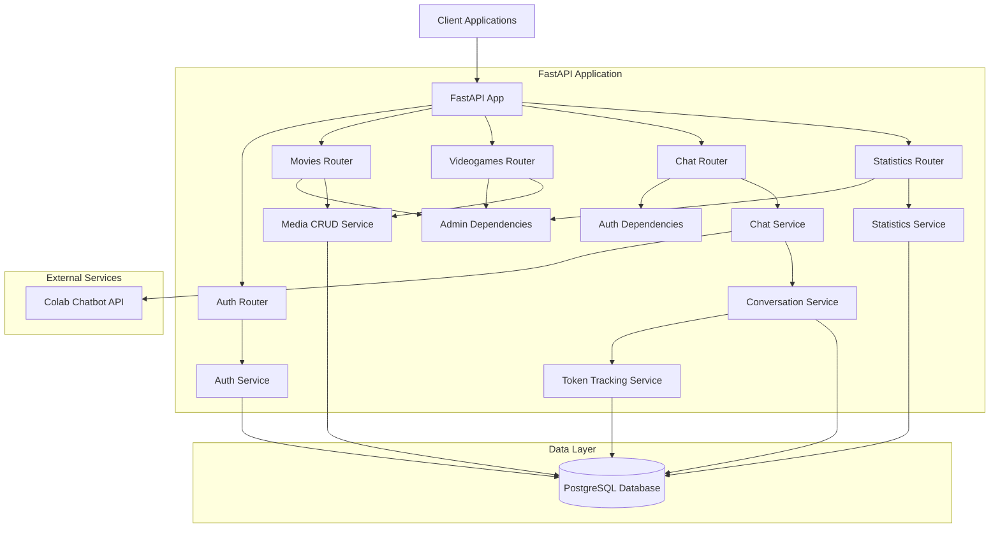
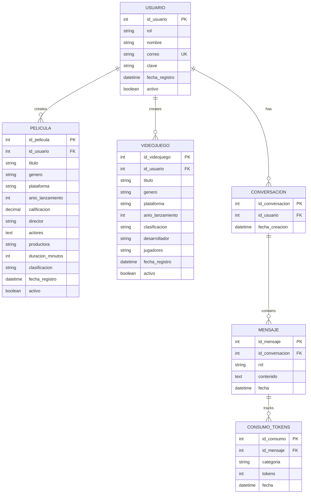

# Design Document: FastAPI Chatbot Backend

## Overview

The FastAPI Chatbot Backend is a REST API service that manages a multimedia catalog (movies and videogames), provides secure user authentication with role-based access control, and integrates with an external Colab-hosted chatbot API. The system logs all conversations and tracks token consumption for cost monitoring and usage analytics.

**Core Capabilities:**
- JWT-based authentication with bcrypt password hashing
- Role-based access control (user/admin)
- CRUD operations for movies and videogames (admin only)
- Public chat endpoint integrated with external Colab API
- Conversation and message persistence
- Token consumption tracking and statistics

**Key Design Principles:**
- Security first: JWT tokens, bcrypt hashing, role-based guards
- Database-first: SQLAlchemy models aligned with existing PostgreSQL schema
- Separation of concerns: routers, services, dependencies, and models in distinct layers
- Graceful error handling with structured error responses
- Environment-driven configuration for deployment flexibility

## Architecture

### High-Level Architecture



### Component Interaction Flow

**Authentication Flow:**
1. User submits credentials to `/auth/login`
2. AuthService validates credentials against database
3. AuthService generates JWT token with user role
4. Token returned to client
5. Client includes token in Authorization header for protected endpoints
6. AuthDep validates token and extracts user identity
7. AdminDep additionally checks for admin role

**Chat Flow:**
1. User (authenticated or anonymous) sends message to `/chat`
2. ChatService validates message
3. ChatService sends message to Colab API
4. ConversationService creates or retrieves conversation record
5. ConversationService stores user message and chatbot response
6. TokenService extracts token usage from Colab response and stores consumption records
7. Chatbot response returned to user

**CRUD Flow (Movies/Videogames):**
1. Admin sends request to movies or videogames endpoint
2. AdminDep validates JWT token and admin role
3. MediaService performs database operation
4. Result returned to admin

**Statistics Flow:**
1. Admin requests statistics with optional date range
2. AdminDep validates JWT token and admin role
3. StatsService aggregates token consumption from database
4. Statistics returned to admin

## Components and Interfaces

### 1. Database Models (SQLAlchemy ORM)

**Module:** `app/models/database.py`

All models use SQLAlchemy ORM with relationships defined for cascade operations.

```python
# Usuario Model
class Usuario(Base):
    __tablename__ = "usuario"
    
    id_usuario: Mapped[int] = mapped_column(Integer, primary_key=True, autoincrement=True)
    rol: Mapped[str] = mapped_column(String(50), nullable=False)
    nombre: Mapped[str] = mapped_column(String(100), nullable=False)
    correo: Mapped[str] = mapped_column(String(255), unique=True, nullable=False)
    clave: Mapped[str] = mapped_column(String(255), nullable=False)
    fecha_registro: Mapped[datetime] = mapped_column(DateTime, nullable=False, server_default=func.now())
    activo: Mapped[bool] = mapped_column(Boolean, nullable=False, default=True)
    
    # Relationships
    peliculas: Mapped[List["Pelicula"]] = relationship(back_populates="usuario", cascade="all, delete-orphan")
    videojuegos: Mapped[List["Videojuego"]] = relationship(back_populates="usuario", cascade="all, delete-orphan")
    conversaciones: Mapped[List["Conversacion"]] = relationship(back_populates="usuario", cascade="all, delete-orphan")

# Pelicula Model
class Pelicula(Base):
    __tablename__ = "pelicula"
    
    id_pelicula: Mapped[int] = mapped_column(Integer, primary_key=True, autoincrement=True)
    id_usuario: Mapped[int] = mapped_column(Integer, ForeignKey("usuario.id_usuario"), nullable=False)
    productora: Mapped[str] = mapped_column(String(200), nullable=False)
    titulo: Mapped[str] = mapped_column(String(200), nullable=False)
    genero: Mapped[str] = mapped_column(String(100), nullable=False)
    plataforma: Mapped[str] = mapped_column(String(100), nullable=False)
    anio_lanzamiento: Mapped[int] = mapped_column(Integer, nullable=False)
    calificacion: Mapped[Optional[Decimal]] = mapped_column(Numeric(2, 1), nullable=True)
    director: Mapped[str] = mapped_column(String(200), nullable=False)
    actores: Mapped[Optional[str]] = mapped_column(Text, nullable=True)
    duracion_minutos: Mapped[int] = mapped_column(Integer, nullable=False)
    clasificacion: Mapped[str] = mapped_column(String(10), nullable=False)
    fecha_registro: Mapped[datetime] = mapped_column(DateTime, nullable=False, server_default=func.now())
    activo: Mapped[bool] = mapped_column(Boolean, nullable=False, default=True)
    
    # Relationships
    usuario: Mapped["Usuario"] = relationship(back_populates="peliculas")

# Videojuego Model
class Videojuego(Base):
    __tablename__ = "videojuego"
    
    id_videojuego: Mapped[int] = mapped_column(Integer, primary_key=True, autoincrement=True)
    id_usuario: Mapped[int] = mapped_column(Integer, ForeignKey("usuario.id_usuario"), nullable=False)
    titulo: Mapped[str] = mapped_column(String(200), nullable=False)
    genero: Mapped[str] = mapped_column(String(100), nullable=False)
    plataforma: Mapped[str] = mapped_column(String(100), nullable=False)
    anio_lanzamiento: Mapped[int] = mapped_column(Integer, nullable=False)
    clasificacion: Mapped[str] = mapped_column(String(10), nullable=False)
    desarrollador: Mapped[str] = mapped_column(String(200), nullable=False)
    jugadores: Mapped[Optional[str]] = mapped_column(String(50), nullable=True)
    fecha_registro: Mapped[datetime] = mapped_column(DateTime, nullable=False, server_default=func.now())
    activo: Mapped[bool] = mapped_column(Boolean, nullable=False, default=True)
    
    # Relationships
    usuario: Mapped["Usuario"] = relationship(back_populates="videojuegos")

# Conversacion Model
class Conversacion(Base):
    __tablename__ = "conversacion"
    
    id_conversacion: Mapped[int] = mapped_column(Integer, primary_key=True, autoincrement=True)
    id_usuario: Mapped[int] = mapped_column(Integer, ForeignKey("usuario.id_usuario"), nullable=False)
    fecha_creacion: Mapped[datetime] = mapped_column(DateTime, nullable=False, server_default=func.now())
    
    # Relationships
    usuario: Mapped["Usuario"] = relationship(back_populates="conversaciones")
    mensajes: Mapped[List["Mensaje"]] = relationship(back_populates="conversacion", cascade="all, delete-orphan")

# Mensaje Model
class Mensaje(Base):
    __tablename__ = "mensajes"
    
    id_mensaje: Mapped[int] = mapped_column(Integer, primary_key=True, autoincrement=True)
    id_conversacion: Mapped[int] = mapped_column(Integer, ForeignKey("conversacion.id_conversacion"), nullable=False)
    rol: Mapped[str] = mapped_column(String(20), nullable=False)
    contenido: Mapped[str] = mapped_column(Text, nullable=False)
    fecha: Mapped[datetime] = mapped_column(DateTime, nullable=False, server_default=func.now())
    
    # Relationships
    conversacion: Mapped["Conversacion"] = relationship(back_populates="mensajes")
    consumo_tokens: Mapped[List["ConsumoToken"]] = relationship(back_populates="mensaje", cascade="all, delete-orphan")

# ConsumoToken Model
class ConsumoToken(Base):
    __tablename__ = "consumo_tokens"
    
    id_consumo: Mapped[int] = mapped_column(Integer, primary_key=True, autoincrement=True)
    id_mensaje: Mapped[int] = mapped_column(Integer, ForeignKey("mensajes.id_mensaje"), nullable=False)
    categoria: Mapped[str] = mapped_column(String(50), nullable=False)
    tokens: Mapped[int] = mapped_column(Integer, nullable=False)
    fecha: Mapped[datetime] = mapped_column(DateTime, nullable=False, server_default=func.now())
    
    # Relationships
    mensaje: Mapped["Mensaje"] = relationship(back_populates="consumo_tokens")
```

**Design Decisions:**
- Use SQLAlchemy 2.0+ `Mapped` type annotations for type safety
- Cascade delete relationships ensure referential integrity
- `server_default=func.now()` ensures timestamps are set by database
- Boolean `activo` field enables soft deletes for media items
- Foreign key constraints match existing database schema

### 2. Pydantic Schemas

**Module:** `app/schemas/`

Pydantic models for request validation and response serialization.

```python
# Authentication Schemas
class UserRegister(BaseModel):
    nombre: str = Field(..., max_length=100)
    correo: EmailStr = Field(..., max_length=255)
    clave: str = Field(..., min_length=8)
    rol: Optional[str] = Field(default="user", pattern="^(user|admin)$")

class UserLogin(BaseModel):
    correo: EmailStr
    clave: str

class TokenResponse(BaseModel):
    access_token: str
    token_type: str = "bearer"
    expires_in: int

# Movie Schemas
class MovieCreate(BaseModel):
    productora: str = Field(..., max_length=200)
    titulo: str = Field(..., max_length=200)
    genero: str = Field(..., max_length=100)
    plataforma: str = Field(..., max_length=100)
    anio_lanzamiento: int = Field(..., ge=1888, le=date.today().year + 5)
    calificacion: Optional[Decimal] = Field(None, ge=0.0, le=10.0)
    director: str = Field(..., max_length=200)
    actores: Optional[str] = None
    duracion_minutos: int = Field(..., ge=1, le=1000)
    clasificacion: str = Field(..., max_length=10)
    
    @field_validator('actores')
    def validate_actores(cls, v):
        if v and len(v.split(',')) > 10:
            raise ValueError('Maximum 10 comma-separated actor names allowed')
        return v

class MovieUpdate(BaseModel):
    productora: Optional[str] = Field(None, max_length=200)
    titulo: Optional[str] = Field(None, max_length=200)
    genero: Optional[str] = Field(None, max_length=100)
    plataforma: Optional[str] = Field(None, max_length=100)
    anio_lanzamiento: Optional[int] = Field(None, ge=1888, le=date.today().year + 5)
    calificacion: Optional[Decimal] = Field(None, ge=0.0, le=10.0)
    director: Optional[str] = Field(None, max_length=200)
    actores: Optional[str] = None
    duracion_minutos: Optional[int] = Field(None, ge=1, le=1000)
    clasificacion: Optional[str] = Field(None, max_length=10)

class MovieResponse(BaseModel):
    id_pelicula: int
    titulo: str
    genero: str
    plataforma: str
    anio_lanzamiento: int
    director: str
    duracion_minutos: int
    calificacion: Optional[Decimal]
    actores: Optional[str]
    clasificacion: str
    productora: str
    fecha_registro: datetime
    
    model_config = ConfigDict(from_attributes=True)

# Videogame Schemas
class VideogameCreate(BaseModel):
    titulo: str = Field(..., max_length=200)
    genero: str = Field(..., max_length=100)
    plataforma: str = Field(..., max_length=100)
    anio_lanzamiento: int = Field(..., ge=1958, le=date.today().year + 5)
    clasificacion: str = Field(..., pattern="^(E|E10\\+|T|M|AO|RP)$", max_length=10)
    desarrollador: str = Field(..., max_length=200)
    jugadores: Optional[str] = Field(None, max_length=50)
    
    @field_validator('jugadores')
    def validate_jugadores(cls, v):
        if v:
            if not re.match(r'^\d+(-\d+)?(\+)?$', v):
                raise ValueError('Jugadores must be a positive integer or range (e.g., "1-4")')
        return v

class VideogameUpdate(BaseModel):
    titulo: Optional[str] = Field(None, max_length=200)
    genero: Optional[str] = Field(None, max_length=100)
    plataforma: Optional[str] = Field(None, max_length=100)
    anio_lanzamiento: Optional[int] = Field(None, ge=1958, le=date.today().year + 5)
    clasificacion: Optional[str] = Field(None, pattern="^(E|E10\\+|T|M|AO|RP)$", max_length=10)
    desarrollador: Optional[str] = Field(None, max_length=200)
    jugadores: Optional[str] = Field(None, max_length=50)

class VideogameResponse(BaseModel):
    id_videojuego: int
    titulo: str
    genero: str
    plataforma: str
    anio_lanzamiento: int
    clasificacion: str
    desarrollador: str
    jugadores: Optional[str]
    fecha_registro: datetime
    
    model_config = ConfigDict(from_attributes=True)

# Chat Schemas
class ChatRequest(BaseModel):
    message: str = Field(..., max_length=10000, min_length=1)

class ChatResponse(BaseModel):
    response: str
    conversation_id: int
    message_id: int

# Statistics Schemas
class TokenStats(BaseModel):
    date: date
    total_tokens: int
    message_count: int

class UserTokenStats(BaseModel):
    user_id: int
    user_name: str
    total_tokens: int
    message_count: int

class StatisticsResponse(BaseModel):
    daily_stats: List[TokenStats]
    user_stats: List[UserTokenStats]
    date_range: dict
```

**Design Decisions:**
- Field validators enforce business rules at the API boundary
- Separate Create/Update schemas provide flexibility
- Response schemas use `from_attributes=True` for ORM conversion
- Email validation using Pydantic's `EmailStr`
- Regex patterns for complex validation (clasificacion, jugadores)

### 3. Authentication Service

**Module:** `app/services/auth_service.py`

Handles user registration, login, password hashing, and JWT token generation.

```python
class AuthService:
    def __init__(self, db: Session, config: Settings):
        self.db = db
        self.config = config
        self.pwd_context = CryptContext(schemes=["bcrypt"], deprecated="auto")
    
    def hash_password(self, password: str) -> str:
        """Hash password using bcrypt"""
        return self.pwd_context.hash(password)
    
    def verify_password(self, plain_password: str, hashed_password: str) -> bool:
        """Verify password against hash"""
        return self.pwd_context.verify(plain_password, hashed_password)
    
    def create_jwt_token(self, user_id: int, role: str) -> dict:
        """Generate JWT token with expiration"""
        expiration = datetime.utcnow() + timedelta(minutes=self.config.jwt_expiration_minutes)
        payload = {
            "sub": str(user_id),
            "role": role,
            "exp": expiration,
            "iat": datetime.utcnow()
        }
        token = jwt.encode(payload, self.config.jwt_secret_key, algorithm=self.config.jwt_algorithm)
        return {
            "access_token": token,
            "token_type": "bearer",
            "expires_in": self.config.jwt_expiration_minutes * 60
        }
    
    def register_user(self, user_data: UserRegister) -> Usuario:
        """Register new user with hashed password"""
        # Check if email exists
        existing = self.db.query(Usuario).filter(Usuario.correo == user_data.correo).first()
        if existing:
            raise HTTPException(status_code=409, detail="Email already registered")
        
        # Create user with hashed password
        user = Usuario(
            nombre=user_data.nombre,
            correo=user_data.correo,
            clave=self.hash_password(user_data.clave),
            rol=user_data.rol or "user",
            fecha_registro=datetime.utcnow(),
            activo=True
        )
        self.db.add(user)
        self.db.commit()
        self.db.refresh(user)
        return user
    
    def login_user(self, login_data: UserLogin) -> dict:
        """Authenticate user and return JWT token"""
        user = self.db.query(Usuario).filter(Usuario.correo == login_data.correo).first()
        
        if not user or not self.verify_password(login_data.clave, user.clave):
            raise HTTPException(status_code=401, detail="Invalid email or password")
        
        if not user.activo:
            raise HTTPException(status_code=403, detail="Account is inactive")
        
        return self.create_jwt_token(user.id_usuario, user.rol)
```

**Design Decisions:**
- bcrypt used for password hashing (industry standard)
- JWT tokens include user ID, role, issued at, and expiration
- Token expiration configurable via environment
- Email uniqueness checked before registration
- Inactive users cannot login

### 4. Authorization Dependencies

**Module:** `app/dependencies/auth_dependencies.py`

FastAPI dependencies for extracting and validating JWT tokens.

```python
oauth2_scheme = OAuth2PasswordBearer(tokenUrl="/auth/login")

async def get_current_user(
    token: str = Depends(oauth2_scheme),
    db: Session = Depends(get_db),
    config: Settings = Depends(get_settings)
) -> Usuario:
    """Extract and validate JWT token, return current user"""
    try:
        payload = jwt.decode(token, config.jwt_secret_key, algorithms=[config.jwt_algorithm])
        user_id: int = int(payload.get("sub"))
        role: str = payload.get("role")
        
        if user_id is None:
            raise HTTPException(status_code=401, detail="Invalid token signature")
            
    except jwt.ExpiredSignatureError:
        raise HTTPException(status_code=401, detail="Token has expired")
    except jwt.InvalidTokenError:
        raise HTTPException(status_code=401, detail="Malformed token structure")
    except Exception:
        raise HTTPException(status_code=401, detail="Invalid token signature")
    
    user = db.query(Usuario).filter(Usuario.id_usuario == user_id).first()
    if not user:
        raise HTTPException(status_code=401, detail="User not found")
    
    return user

async def require_admin(current_user: Usuario = Depends(get_current_user)) -> Usuario:
    """Ensure current user has admin role"""
    if current_user.rol != "admin":
        raise HTTPException(status_code=403, detail="Admin access required")
    return current_user

async def get_optional_user(
    authorization: Optional[str] = Header(None),
    db: Session = Depends(get_db),
    config: Settings = Depends(get_settings)
) -> Optional[Usuario]:
    """Extract user from token if present, otherwise return None"""
    if not authorization or not authorization.startswith("Bearer "):
        return None
    
    token = authorization.split(" ")[1]
    try:
        payload = jwt.decode(token, config.jwt_secret_key, algorithms=[config.jwt_algorithm])
        user_id: int = int(payload.get("sub"))
        return db.query(Usuario).filter(Usuario.id_usuario == user_id).first()
    except:
        return None
```

**Design Decisions:**
- `get_current_user` validates token and returns authenticated user
- `require_admin` chains on `get_current_user` to enforce admin role
- `get_optional_user` allows anonymous access (for chat endpoint)
- Token errors return specific error messages for debugging
- Use FastAPI's `Depends()` for dependency injection

### 5. Media CRUD Service

**Module:** `app/services/media_service.py`

Handles CRUD operations for movies and videogames with validation and filtering.

```python
class MediaService:
    def __init__(self, db: Session):
        self.db = db
    
    # Movie operations
    def create_movie(self, movie_data: MovieCreate, user_id: int) -> Pelicula:
        """Create new movie record"""
        movie = Pelicula(
            **movie_data.model_dump(),
            id_usuario=user_id,
            fecha_registro=datetime.utcnow(),
            activo=True
        )
        self.db.add(movie)
        self.db.commit()
        self.db.refresh(movie)
        return movie
    
    def get_movies(
        self, 
        genero: Optional[str] = None,
        plataforma: Optional[str] = None,
        anio_lanzamiento: Optional[int] = None,
        page: int = 1,
        page_size: int = 20
    ) -> Tuple[List[Pelicula], int]:
        """Get all active movies with optional filtering and pagination"""
        query = self.db.query(Pelicula).filter(Pelicula.activo == True)
        
        if genero:
            query = query.filter(Pelicula.genero == genero)
        if plataforma:
            query = query.filter(Pelicula.plataforma == plataforma)
        if anio_lanzamiento:
            query = query.filter(Pelicula.anio_lanzamiento == anio_lanzamiento)
        
        total = query.count()
        movies = query.offset((page - 1) * page_size).limit(page_size).all()
        
        return movies, total
    
    def get_movie_by_id(self, movie_id: int) -> Pelicula:
        """Get movie by ID"""
        movie = self.db.query(Pelicula).filter(
            Pelicula.id_pelicula == movie_id,
            Pelicula.activo == True
        ).first()
        
        if not movie:
            raise HTTPException(status_code=404, detail="Movie not found")
        
        return movie
    
    def update_movie(self, movie_id: int, movie_data: MovieUpdate, user_id: int) -> Pelicula:
        """Update existing movie"""
        movie = self.get_movie_by_id(movie_id)
        
        update_data = movie_data.model_dump(exclude_unset=True)
        for field, value in update_data.items():
            setattr(movie, field, value)
        
        movie.id_usuario = user_id
        self.db.commit()
        self.db.refresh(movie)
        return movie
    
    def delete_movie(self, movie_id: int) -> None:
        """Soft delete movie"""
        movie = self.get_movie_by_id(movie_id)
        movie.activo = False
        self.db.commit()
    
    # Videogame operations (similar structure to movies)
    def create_videogame(self, videogame_data: VideogameCreate, user_id: int) -> Videojuego:
        """Create new videogame record"""
        videogame = Videojuego(
            **videogame_data.model_dump(),
            id_usuario=user_id,
            fecha_registro=datetime.utcnow(),
            activo=True
        )
        self.db.add(videogame)
        self.db.commit()
        self.db.refresh(videogame)
        return videogame
    
    def get_videogames(
        self,
        genero: Optional[str] = None,
        plataforma: Optional[str] = None,
        anio_lanzamiento: Optional[int] = None,
        clasificacion: Optional[str] = None,
        page: int = 1,
        page_size: int = 20
    ) -> Tuple[List[Videojuego], int]:
        """Get all active videogames with optional filtering and pagination"""
        query = self.db.query(Videojuego).filter(Videojuego.activo == True)
        
        if genero:
            # Support comma-separated values
            generos = [g.strip() for g in genero.split(',')]
            query = query.filter(Videojuego.genero.in_(generos))
        
        if plataforma:
            plataformas = [p.strip() for p in plataforma.split(',')]
            query = query.filter(Videojuego.plataforma.in_(plataformas))
        
        if anio_lanzamiento:
            query = query.filter(Videojuego.anio_lanzamiento == anio_lanzamiento)
        
        if clasificacion:
            valid_clasificaciones = ["E", "E10+", "T", "M", "AO", "RP"]
            clasificaciones = [c.strip() for c in clasificacion.split(',')]
            
            for c in clasificaciones:
                if c not in valid_clasificaciones:
                    raise HTTPException(
                        status_code=422,
                        detail=f"Invalid CLASIFICACION value. Valid values: {', '.join(valid_clasificaciones)}"
                    )
            
            query = query.filter(Videojuego.clasificacion.in_(clasificaciones))
        
        total = query.count()
        videogames = query.offset((page - 1) * page_size).limit(page_size).all()
        
        return videogames, total
    
    def get_videogame_by_id(self, videogame_id: int) -> Videojuego:
        """Get videogame by ID"""
        videogame = self.db.query(Videojuego).filter(
            Videojuego.id_videojuego == videogame_id,
            Videojuego.activo == True
        ).first()
        
        if not videogame:
            raise HTTPException(status_code=404, detail="Videogame not found")
        
        return videogame
    
    def update_videogame(self, videogame_id: int, videogame_data: VideogameUpdate, user_id: int) -> Videojuego:
        """Update existing videogame"""
        videogame = self.get_videogame_by_id(videogame_id)
        
        update_data = videogame_data.model_dump(exclude_unset=True)
        for field, value in update_data.items():
            setattr(videogame, field, value)
        
        videogame.id_usuario = user_id
        self.db.commit()
        self.db.refresh(videogame)
        return videogame
    
    def delete_videogame(self, videogame_id: int) -> None:
        """Soft delete videogame"""
        videogame = self.get_videogame_by_id(videogame_id)
        videogame.activo = False
        self.db.commit()
```

**Design Decisions:**
- Soft delete using `activo` flag preserves data integrity
- Pagination returns both results and total count
- Filtering supports comma-separated values for multiple selections
- Update operations only modify provided fields (`exclude_unset=True`)
- Admin user ID tracked for audit trail

### 6. Chat Service and Colab Integration

**Module:** `app/services/chat_service.py`

Handles chat message processing, Colab API integration, conversation persistence, and token tracking.

```python
class ChatService:
    def __init__(self, db: Session, config: Settings):
        self.db = db
        self.config = config
        self.colab_api_url = config.colab_api_url
        self.timeout = 30  # seconds
    
    async def send_to_colab(self, message: str) -> dict:
        """Send message to Colab API and return response"""
        if not self.colab_api_url:
            raise HTTPException(status_code=500, detail="Chatbot service not configured")
        
        try:
            async with httpx.AsyncClient(timeout=self.timeout) as client:
                response = await client.post(
                    self.colab_api_url,
                    json={"message": message}
                )
                
                if response.status_code != 200:
                    raise HTTPException(
                        status_code=503,
                        detail="Chatbot service temporarily unavailable"
                    )
                
                return response.json()
                
        except httpx.TimeoutException:
            raise HTTPException(status_code=504, detail="Chatbot service timeout")
        except Exception as e:
            logger.error(f"Colab API error: {str(e)}")
            raise HTTPException(
                status_code=503,
                detail="Chatbot service temporarily unavailable"
            )
    
    def get_or_create_conversation(self, user_id: int) -> Conversacion:
        """Get most recent conversation or create new one"""
        # Look for conversation created in last 24 hours
        cutoff = datetime.utcnow() - timedelta(hours=24)
        
        conversation = self.db.query(Conversacion).filter(
            Conversacion.id_usuario == user_id,
            Conversacion.fecha_creacion >= cutoff
        ).order_by(Conversacion.fecha_creacion.desc()).first()
        
        if not conversation:
            conversation = Conversacion(
                id_usuario=user_id,
                fecha_creacion=datetime.utcnow()
            )
            self.db.add(conversation)
            self.db.commit()
            self.db.refresh(conversation)
        
        return conversation
    
    def save_message(self, conversation_id: int, role: str, content: str) -> Mensaje:
        """Save message to database"""
        if role not in ["user", "assistant"]:
            raise HTTPException(
                status_code=422,
                detail="ROL must be either 'user' or 'assistant'"
            )
        
        message = Mensaje(
            id_conversacion=conversation_id,
            rol=role,
            contenido=content,
            fecha=datetime.utcnow()
        )
        self.db.add(message)
        self.db.commit()
        self.db.refresh(message)
        return message
    
    def track_tokens(self, message_id: int, token_data: dict) -> None:
        """Track token consumption from Colab response"""
        try:
            # Extract token information from response
            prompt_tokens = token_data.get("prompt_tokens", 0)
            completion_tokens = token_data.get("completion_tokens", 0)
            total_tokens = token_data.get("total_tokens", 0)
            
            # Validate token values
            if any(isinstance(t, (int, float)) and (t < 0 or t > 1000000) 
                   for t in [prompt_tokens, completion_tokens, total_tokens]):
                logger.warning(f"Invalid token values in response: {token_data}")
                prompt_tokens = completion_tokens = total_tokens = 0
            
            # Store token records
            for categoria, tokens in [
                ("prompt_tokens", prompt_tokens),
                ("completion_tokens", completion_tokens),
                ("total_tokens", total_tokens)
            ]:
                consumo = ConsumoToken(
                    id_mensaje=message_id,
                    categoria=categoria,
                    tokens=int(tokens),
                    fecha=datetime.utcnow()
                )
                self.db.add(consumo)
            
            self.db.commit()
            
        except Exception as e:
            # Log error but don't fail the chat response
            logger.error(f"Failed to track tokens: {str(e)}")
            
            # Store unavailable record
            consumo = ConsumoToken(
                id_mensaje=message_id,
                categoria="unavailable",
                tokens=0,
                fecha=datetime.utcnow()
            )
            self.db.add(consumo)
            self.db.commit()
    
    async def process_chat(self, message: str, user: Optional[Usuario]) -> ChatResponse:
        """Process complete chat flow"""
        # Determine user ID (1 for anonymous)
        user_id = user.id_usuario if user else 1
        
        # Get or create conversation
        conversation = self.get_or_create_conversation(user_id)
        
        # Save user message
        user_message = self.save_message(conversation.id_conversacion, "user", message)
        
        # Send to Colab API
        colab_response = await self.send_to_colab(message)
        
        # Extract chatbot response text
        response_text = colab_response.get("response", "")
        
        # Save assistant message
        assistant_message = self.save_message(
            conversation.id_conversacion,
            "assistant",
            response_text
        )
        
        # Track token consumption
        token_data = colab_response.get("usage", {})
        self.track_tokens(assistant_message.id_mensaje, token_data)
        
        return ChatResponse(
            response=response_text,
            conversation_id=conversation.id_conversacion,
            message_id=assistant_message.id_mensaje
        )
```

**Design Decisions:**
- Async HTTP client (httpx) for non-blocking Colab API calls
- 30-second timeout prevents indefinite waiting
- Conversations reused within 24-hour window
- Anonymous users assigned to default user (ID=1)
- Token tracking failures logged but don't break chat flow
- Token values validated (0-1000000 range)
- Three token categories stored: prompt, completion, total

### 7. Statistics Service

**Module:** `app/services/statistics_service.py`

Aggregates token consumption data by date and user.

```python
class StatisticsService:
    def __init__(self, db: Session):
        self.db = db
    
    def get_statistics(
        self,
        start_date: Optional[date] = None,
        end_date: Optional[date] = None
    ) -> StatisticsResponse:
        """Get token consumption statistics with optional date range"""
        
        # Default to last 30 days if no range specified
        if not end_date:
            end_date = date.today()
        if not start_date:
            start_date = end_date - timedelta(days=30)
        
        # Validate date range
        if start_date > end_date:
            raise HTTPException(
                status_code=422,
                detail="start_date cannot be after end_date"
            )
        
        # Query daily statistics
        daily_query = self.db.query(
            func.date(ConsumoToken.fecha).label('date'),
            func.sum(ConsumoToken.tokens).label('total_tokens'),
            func.count(distinct(ConsumoToken.id_mensaje)).label('message_count')
        ).filter(
            func.date(ConsumoToken.fecha) >= start_date,
            func.date(ConsumoToken.fecha) <= end_date,
            ConsumoToken.categoria == "total_tokens"  # Only count total, not duplicates
        ).group_by(
            func.date(ConsumoToken.fecha)
        ).order_by(
            desc(func.date(ConsumoToken.fecha))
        ).all()
        
        # Query user statistics
        user_query = self.db.query(
            Usuario.id_usuario,
            Usuario.nombre,
            func.sum(ConsumoToken.tokens).label('total_tokens'),
            func.count(distinct(Mensaje.id_mensaje)).label('message_count')
        ).join(
            Conversacion, Conversacion.id_usuario == Usuario.id_usuario
        ).join(
            Mensaje, Mensaje.id_conversacion == Conversacion.id_conversacion
        ).join(
            ConsumoToken, ConsumoToken.id_mensaje == Mensaje.id_mensaje
        ).filter(
            func.date(ConsumoToken.fecha) >= start_date,
            func.date(ConsumoToken.fecha) <= end_date,
            ConsumoToken.categoria == "total_tokens"
        ).group_by(
            Usuario.id_usuario,
            Usuario.nombre
        ).order_by(
            desc(func.sum(ConsumoToken.tokens))
        ).all()
        
        # Format response
        daily_stats = [
            TokenStats(
                date=row.date,
                total_tokens=row.total_tokens or 0,
                message_count=row.message_count or 0
            )
            for row in daily_query
        ]
        
        user_stats = [
            UserTokenStats(
                user_id=row.id_usuario,
                user_name=row.nombre,
                total_tokens=row.total_tokens or 0,
                message_count=row.message_count or 0
            )
            for row in user_query
        ]
        
        return StatisticsResponse(
            daily_stats=daily_stats,
            user_stats=user_stats,
            date_range={
                "start_date": start_date.isoformat(),
                "end_date": end_date.isoformat()
            }
        )
```

**Design Decisions:**
- Default to last 30 days if no date range provided
- Only count "total_tokens" category to avoid triple-counting
- Use `distinct()` to count unique messages
- Order daily stats descending (most recent first)
- Order user stats by total tokens descending (highest consumers first)
- Return empty arrays if no data (not 404)
- Join across four tables for user stats

### 8. API Routers

**Module:** `app/routers/`

FastAPI routers organize endpoints by resource type.

**Auth Router (`auth_router.py`):**
```python
router = APIRouter(prefix="/auth", tags=["Authentication"])

@router.post("/register", response_model=TokenResponse, status_code=201)
async def register(
    user_data: UserRegister,
    db: Session = Depends(get_db),
    config: Settings = Depends(get_settings)
):
    """Register new user and return JWT token"""
    auth_service = AuthService(db, config)
    user = auth_service.register_user(user_data)
    return auth_service.create_jwt_token(user.id_usuario, user.rol)

@router.post("/login", response_model=TokenResponse)
async def login(
    login_data: UserLogin,
    db: Session = Depends(get_db),
    config: Settings = Depends(get_settings)
):
    """Authenticate user and return JWT token"""
    auth_service = AuthService(db, config)
    return auth_service.login_user(login_data)
```

**Movies Router (`movies_router.py`):**
```python
router = APIRouter(prefix="/movies", tags=["Movies"])

@router.post("/", response_model=MovieResponse, status_code=201)
async def create_movie(
    movie_data: MovieCreate,
    current_user: Usuario = Depends(require_admin),
    db: Session = Depends(get_db)
):
    """Create new movie (admin only)"""
    service = MediaService(db)
    movie = service.create_movie(movie_data, current_user.id_usuario)
    return movie

@router.get("/", response_model=List[MovieResponse])
async def get_movies(
    genero: Optional[str] = None,
    plataforma: Optional[str] = None,
    anio_lanzamiento: Optional[int] = None,
    page: int = Query(1, ge=1),
    page_size: int = Query(20, ge=1, le=100),
    current_user: Usuario = Depends(require_admin),
    db: Session = Depends(get_db)
):
    """Get all movies with optional filtering (admin only)"""
    service = MediaService(db)
    movies, total = service.get_movies(genero, plataforma, anio_lanzamiento, page, page_size)
    return movies

@router.get("/{movie_id}", response_model=MovieResponse)
async def get_movie(
    movie_id: int,
    current_user: Usuario = Depends(require_admin),
    db: Session = Depends(get_db)
):
    """Get movie by ID (admin only)"""
    service = MediaService(db)
    return service.get_movie_by_id(movie_id)

@router.put("/{movie_id}", response_model=MovieResponse)
async def update_movie(
    movie_id: int,
    movie_data: MovieUpdate,
    current_user: Usuario = Depends(require_admin),
    db: Session = Depends(get_db)
):
    """Update movie (admin only)"""
    service = MediaService(db)
    return service.update_movie(movie_id, movie_data, current_user.id_usuario)

@router.delete("/{movie_id}", status_code=204)
async def delete_movie(
    movie_id: int,
    current_user: Usuario = Depends(require_admin),
    db: Session = Depends(get_db)
):
    """Delete movie (admin only)"""
    service = MediaService(db)
    service.delete_movie(movie_id)
    return None
```

**Videogames Router (`videogames_router.py`):**
```python
router = APIRouter(prefix="/videogames", tags=["Videogames"])

# Similar structure to movies router
# All endpoints require admin authentication
```

**Chat Router (`chat_router.py`):**
```python
router = APIRouter(prefix="/chat", tags=["Chat"])

@router.post("/", response_model=ChatResponse)
async def chat(
    chat_data: ChatRequest,
    user: Optional[Usuario] = Depends(get_optional_user),
    db: Session = Depends(get_db),
    config: Settings = Depends(get_settings)
):
    """Send message to chatbot (public endpoint)"""
    service = ChatService(db, config)
    return await service.process_chat(chat_data.message, user)
```

**Statistics Router (`statistics_router.py`):**
```python
router = APIRouter(prefix="/statistics", tags=["Statistics"])

@router.get("/", response_model=StatisticsResponse)
async def get_statistics(
    start_date: Optional[date] = Query(None, description="Start date (YYYY-MM-DD)"),
    end_date: Optional[date] = Query(None, description="End date (YYYY-MM-DD)"),
    current_user: Usuario = Depends(require_admin),
    db: Session = Depends(get_db)
):
    """Get token consumption statistics (admin only)"""
    service = StatisticsService(db)
    return service.get_statistics(start_date, end_date)
```

**Design Decisions:**
- Routers organized by resource for clarity
- Admin endpoints use `require_admin` dependency
- Chat endpoint uses `get_optional_user` for anonymous access
- Query parameters with validation using FastAPI's `Query`
- Consistent response models across endpoints
- Tags enable OpenAPI documentation grouping

## Data Models

### Database Relationships



### Schema Notes

- All IDs use auto-incrementing integers (SERIAL in PostgreSQL)
- Timestamps use UTC datetime with server default
- Foreign keys enforce referential integrity
- Cascade deletes maintain data consistency
- Soft deletes (activo flag) for movies and videogames preserve history

## Error Handling

### Global Exception Handlers

**Module:** `app/middleware/error_handlers.py`

```python
async def validation_exception_handler(request: Request, exc: RequestValidationError):
    """Handle Pydantic validation errors"""
    return JSONResponse(
        status_code=422,
        content={
            "error": "validation_error",
            "message": "Request validation failed",
            "details": exc.errors()
        }
    )

async def http_exception_handler(request: Request, exc: HTTPException):
    """Handle HTTP exceptions with structured format"""
    return JSONResponse(
        status_code=exc.status_code,
        content={
            "error": exc.status_code,
            "message": exc.detail
        }
    )

async def database_exception_handler(request: Request, exc: IntegrityError):
    """Handle database constraint violations"""
    # Parse constraint name to provide user-friendly message
    constraint_messages = {
        "usuario_correo_key": "Email already registered",
        "fk_usuario": "Invalid user reference",
        "fk_conversacion": "Invalid conversation reference",
        "fk_mensaje": "Invalid message reference"
    }
    
    error_message = "Database constraint violation"
    for constraint, message in constraint_messages.items():
        if constraint in str(exc):
            error_message = message
            break
    
    return JSONResponse(
        status_code=409,
        content={
            "error": "conflict",
            "message": error_message
        }
    )

async def generic_exception_handler(request: Request, exc: Exception):
    """Handle unexpected errors"""
    # Log full error details
    logger.error(f"Unexpected error: {str(exc)}", exc_info=True)
    
    # Return generic message to user
    return JSONResponse(
        status_code=500,
        content={
            "error": "internal_error",
            "message": "An internal error occurred"
        }
    )
```

### Error Response Format

All errors return consistent JSON structure:
```json
{
  "error": "error_type",
  "message": "Human-readable description",
  "details": []  // Optional, for validation errors
}
```

**Design Decisions:**
- Validation errors (422) include field-level details
- Authentication errors (401) provide specific failure reason
- Authorization errors (403) indicate permission level required
- Database errors (409) translate constraint names to user messages
- Internal errors (500) hide implementation details, log full trace
- All errors return JSON (no HTML error pages)

## Testing Strategy

**Note:** Property-based testing is not applicable for this feature because it primarily involves:
- Database I/O operations
- External API integration (Colab API)
- Infrastructure configuration and authentication
- UI-related endpoints with specific behavior

These components are better tested with integration tests and example-based unit tests.

### Unit Testing

Unit tests verify individual components with mocked dependencies.

**Test Coverage:**

1. **Authentication Service Tests:**
   - Password hashing produces different hashes for same password
   - Password verification succeeds with correct password
   - Password verification fails with incorrect password
   - JWT token includes correct user ID and role
   - JWT token expiration matches configuration
   - Register rejects duplicate emails
   - Register enforces minimum password length
   - Login rejects invalid credentials
   - Login rejects inactive users

2. **Media Service Tests:**
   - Create movie stores all required fields
   - Create videogame validates clasificacion values
   - Update movie preserves fecha_registro
   - Delete movie sets activo to false
   - Get movies filters by genero, plataforma, anio_lanzamiento
   - Get videogames supports comma-separated filter values
   - Get by ID returns 404 for non-existent items
   - Pagination calculates correct offsets

3. **Chat Service Tests:**
   - Send to Colab constructs correct request payload
   - Colab timeout returns 504 error
   - Colab error returns 503 error
   - Get or create conversation reuses recent conversation
   - Get or create conversation creates new after 24 hours
   - Save message validates rol field
   - Track tokens stores three categories
   - Track tokens handles missing token data
   - Anonymous users assigned to user ID 1

4. **Statistics Service Tests:**
   - Default date range is last 30 days
   - Date validation rejects start_date > end_date
   - Daily stats group by date correctly
   - User stats join across four tables
   - Empty results return empty arrays
   - Only total_tokens category counted (no duplicates)

5. **Schema Validation Tests:**
   - MovieCreate rejects invalid anio_lanzamiento
   - MovieCreate validates actores max 10 names
   - VideogameCreate validates jugadores format
   - VideogameCreate validates clasificacion enum
   - ChatRequest enforces max 10000 characters
   - Email validation using Pydantic EmailStr

**Testing Tools:**
- pytest for test framework
- pytest-asyncio for async tests
- SQLAlchemy in-memory database for isolation
- httpx.MockClient for Colab API mocking
- freezegun for time-based tests

### Integration Testing

Integration tests verify end-to-end flows with real database.

**Test Coverage:**

1. **Authentication Flow:**
   - Register new user, verify database record created
   - Login with valid credentials, receive JWT token
   - Use JWT token to access protected endpoint
   - Admin JWT token accesses admin endpoint
   - User JWT token rejected from admin endpoint

2. **Movie CRUD Flow:**
   - Admin creates movie, verify all fields stored
   - Admin retrieves movies with filters
   - Admin updates movie, verify changes persisted
   - Admin deletes movie, verify activo set to false
   - Non-admin user cannot access movie endpoints

3. **Videogame CRUD Flow:**
   - Similar to movie CRUD flow

4. **Chat Flow:**
   - Anonymous user sends message to chat endpoint
   - Message sent to Colab API (mocked)
   - User message stored in database
   - Assistant response stored in database
   - Token consumption stored with three categories
   - Conversation created for anonymous user (ID=1)
   - Authenticated user chat creates conversation with user ID

5. **Statistics Flow:**
   - Admin requests statistics without date range
   - Verify daily stats aggregated by date
   - Verify user stats include message counts
   - Admin requests statistics with date range
   - Verify filtering by date range works

6. **Error Handling:**
   - Invalid JWT token returns 401
   - Expired JWT token returns 401
   - Duplicate email registration returns 409
   - Invalid movie ID returns 404
   - Colab API timeout returns 504
   - Missing required field returns 422

**Testing Tools:**
- pytest with real PostgreSQL test database
- FastAPI TestClient for HTTP requests
- Database fixtures for test data setup/teardown
- Environment variable mocking for configuration

### Manual Testing

Manual testing verifies user experience and edge cases.

1. **Swagger UI Testing:**
   - Test all endpoints through /docs interface
   - Verify authentication with "Authorize" button
   - Check request/response examples match documentation

2. **Performance Testing:**
   - Pagination with large datasets (1000+ movies)
   - Concurrent chat requests (10+ simultaneous)
   - Statistics query with 1 year date range

3. **Security Testing:**
   - Attempt SQL injection in filter parameters
   - Attempt JWT token tampering
   - Test CORS configuration
   - Verify password hashes never returned in responses

4. **Error Recovery:**
   - Database connection loss during request
   - Colab API intermittent failures
   - Invalid token usage tracking data

## Environment Configuration

**Module:** `app/config/settings.py`

Pydantic Settings for environment-based configuration.

```python
class Settings(BaseSettings):
    # Database configuration
    db_host: str
    db_port: int = 5432
    db_name: str
    db_user: str
    db_password: str
    
    # JWT configuration
    jwt_secret_key: str
    jwt_algorithm: str = "HS256"
    jwt_expiration_minutes: int = Field(default=1440, ge=1, le=10080)  # Default 24 hours
    
    # Colab API configuration
    colab_api_url: str
    
    # Application configuration
    app_name: str = "FastAPI Chatbot Backend"
    debug: bool = False
    
    @property
    def database_url(self) -> str:
        """Construct PostgreSQL connection URL"""
        return f"postgresql://{self.db_user}:{self.db_password}@{self.db_host}:{self.db_port}/{self.db_name}"
    
    @model_validator(mode='after')
    def validate_jwt_expiration(self):
        """Validate JWT expiration is within acceptable range"""
        if not 1 <= self.jwt_expiration_minutes <= 10080:
            raise ValueError("JWT_EXPIRATION_MINUTES must be between 1 and 10080")
        return self
    
    model_config = SettingsConfigDict(
        env_file=".env",
        env_file_encoding="utf-8",
        case_sensitive=False
    )

# Singleton instance
_settings: Optional[Settings] = None

def get_settings() -> Settings:
    """Get settings singleton"""
    global _settings
    if _settings is None:
        try:
            _settings = Settings()
        except ValidationError as e:
            logger.error(f"Configuration error: {e}")
            sys.exit(1)
    return _settings
```

### Environment Variables

Required variables in `.env` file:

```env
# Database
DB_HOST=localhost
DB_PORT=5432
DB_NAME=chatbot
DB_USER=postgres
DB_PASSWORD=your_password

# JWT
JWT_SECRET_KEY=your-secret-key-here
JWT_ALGORITHM=HS256
JWT_EXPIRATION_MINUTES=1440

# Colab API
COLAB_API_URL=https://your-colab-api-url.com/chat

# Application
DEBUG=false
```

**Design Decisions:**
- Pydantic validation ensures required variables present
- Sensible defaults for optional variables
- JWT expiration validated on startup
- Application exits with error if configuration invalid
- .env file loaded automatically
- Case-insensitive environment variable names

## Project Structure

```
chatbot-backend/
├── app/
│   ├── __init__.py
│   ├── main.py                      # FastAPI app initialization
│   │
│   ├── config/
│   │   ├── __init__.py
│   │   └── settings.py              # Environment configuration
│   │
│   ├── models/
│   │   ├── __init__.py
│   │   └── database.py              # SQLAlchemy ORM models
│   │
│   ├── schemas/
│   │   ├── __init__.py
│   │   ├── auth_schemas.py          # Auth request/response schemas
│   │   ├── movie_schemas.py         # Movie schemas
│   │   ├── videogame_schemas.py     # Videogame schemas
│   │   ├── chat_schemas.py          # Chat schemas
│   │   └── statistics_schemas.py    # Statistics schemas
│   │
│   ├── services/
│   │   ├── __init__.py
│   │   ├── auth_service.py          # Authentication logic
│   │   ├── media_service.py         # Movie/videogame CRUD
│   │   ├── chat_service.py          # Chat and Colab integration
│   │   └── statistics_service.py    # Statistics aggregation
│   │
│   ├── routers/
│   │   ├── __init__.py
│   │   ├── auth_router.py           # /auth endpoints
│   │   ├── movies_router.py         # /movies endpoints
│   │   ├── videogames_router.py     # /videogames endpoints
│   │   ├── chat_router.py           # /chat endpoint
│   │   └── statistics_router.py     # /statistics endpoint
│   │
│   ├── dependencies/
│   │   ├── __init__.py
│   │   ├── auth_dependencies.py     # JWT validation dependencies
│   │   └── database_dependencies.py # Database session dependency
│   │
│   ├── middleware/
│   │   ├── __init__.py
│   │   ├── error_handlers.py        # Global exception handlers
│   │   └── cors_middleware.py       # CORS configuration
│   │
│   └── utils/
│       ├── __init__.py
│       └── logger.py                # Logging configuration
│
├── tests/
│   ├── __init__.py
│   ├── conftest.py                  # Pytest fixtures
│   │
│   ├── unit/
│   │   ├── __init__.py
│   │   ├── test_auth_service.py
│   │   ├── test_media_service.py
│   │   ├── test_chat_service.py
│   │   ├── test_statistics_service.py
│   │   └── test_schemas.py
│   │
│   └── integration/
│       ├── __init__.py
│       ├── test_auth_flow.py
│       ├── test_movie_crud.py
│       ├── test_videogame_crud.py
│       ├── test_chat_flow.py
│       └── test_statistics_flow.py
│
├── .env                             # Environment variables (not in git)
├── .env.example                     # Environment template
├── .gitignore
├── requirements.txt                 # Python dependencies
├── README.md
└── alembic/                         # Database migrations (optional)
    ├── alembic.ini
    ├── env.py
    └── versions/
```

### Key Files

**`app/main.py`** - Application entry point:
```python
from fastapi import FastAPI
from app.routers import auth_router, movies_router, videogames_router, chat_router, statistics_router
from app.middleware.error_handlers import (
    validation_exception_handler,
    http_exception_handler,
    database_exception_handler,
    generic_exception_handler
)
from app.config.settings import get_settings

app = FastAPI(
    title="Chatbot Backend API",
    description="FastAPI backend for chatbot with media catalog management",
    version="1.0.0"
)

# Exception handlers
app.add_exception_handler(RequestValidationError, validation_exception_handler)
app.add_exception_handler(HTTPException, http_exception_handler)
app.add_exception_handler(IntegrityError, database_exception_handler)
app.add_exception_handler(Exception, generic_exception_handler)

# Routers
app.include_router(auth_router.router)
app.include_router(movies_router.router)
app.include_router(videogames_router.router)
app.include_router(chat_router.router)
app.include_router(statistics_router.router)

@app.on_event("startup")
async def startup_event():
    """Validate configuration on startup"""
    settings = get_settings()
    if not settings.colab_api_url:
        logger.error("COLAB_API_URL is not configured")
        sys.exit(1)
    logger.info(f"Application started: {settings.app_name}")

@app.get("/")
async def root():
    """Health check endpoint"""
    return {"status": "ok", "message": "Chatbot Backend API"}
```

**`requirements.txt`** - Python dependencies:
```txt
fastapi==0.104.1
uvicorn[standard]==0.24.0
sqlalchemy==2.0.23
psycopg2-binary==2.9.9
pydantic==2.5.0
pydantic-settings==2.1.0
python-jose[cryptography]==3.3.0
passlib[bcrypt]==1.7.4
python-multipart==0.0.6
httpx==0.25.2
pytest==7.4.3
pytest-asyncio==0.21.1
```

**Design Decisions:**
- Services layer separates business logic from routes
- Dependencies folder for reusable FastAPI dependencies
- Middleware for cross-cutting concerns (errors, CORS)
- Schemas organized by domain (auth, movies, etc.)
- Tests separated into unit and integration
- Configuration centralized in settings module

## API Endpoints Summary

### Authentication
- `POST /auth/register` - Register new user (returns JWT)
- `POST /auth/login` - Login user (returns JWT)

### Movies (Admin Only)
- `POST /movies` - Create movie
- `GET /movies` - List movies with filters and pagination
- `GET /movies/{id}` - Get movie by ID
- `PUT /movies/{id}` - Update movie
- `DELETE /movies/{id}` - Delete movie (soft delete)

### Videogames (Admin Only)
- `POST /videogames` - Create videogame
- `GET /videogames` - List videogames with filters and pagination
- `GET /videogames/{id}` - Get videogame by ID
- `PUT /videogames/{id}` - Update videogame
- `DELETE /videogames/{id}` - Delete videogame (soft delete)

### Chat (Public)
- `POST /chat` - Send message to chatbot

### Statistics (Admin Only)
- `GET /statistics` - Get token consumption statistics

### Documentation
- `GET /docs` - Swagger UI interactive documentation
- `GET /redoc` - ReDoc alternative documentation
- `GET /` - Health check

## Security Considerations

1. **Password Security:**
   - bcrypt hashing with automatic salt
   - Minimum 8 character password requirement
   - Passwords never returned in responses

2. **JWT Security:**
   - Tokens signed with secret key
   - Configurable expiration (1-10080 minutes)
   - Role included in token payload
   - Token validation on every protected request

3. **Input Validation:**
   - Pydantic schemas validate all inputs
   - SQL injection prevented by ORM parameterization
   - Field length limits enforced
   - Email format validation

4. **Authorization:**
   - Role-based access control
   - Admin-only endpoints protected
   - Anonymous access only to chat endpoint
   - User identity extracted from JWT token

5. **Error Handling:**
   - Internal errors hide implementation details
   - Stack traces only in logs, never in responses
   - Database constraint violations sanitized

6. **API Security:**
   - CORS configuration for allowed origins
   - Rate limiting (recommendation: add middleware)
   - HTTPS enforcement in production

## Deployment Considerations

1. **Environment Setup:**
   - PostgreSQL database with schema created
   - .env file with all required variables
   - JWT_SECRET_KEY generated securely
   - Colab API URL configured and accessible

2. **Database Migrations:**
   - Use Alembic for schema migrations
   - Initial migration from existing schema
   - Version control for schema changes

3. **Monitoring:**
   - Application logs to structured format
   - Token consumption monitoring
   - Colab API response time tracking
   - Database connection pool monitoring

4. **Performance:**
   - Database indexes on foreign keys
   - Pagination for large result sets
   - Connection pooling for database
   - Async Colab API calls prevent blocking

5. **Scalability:**
   - Stateless application design
   - Horizontal scaling with load balancer
   - Database read replicas for queries
   - Redis for session/caching (future enhancement)
