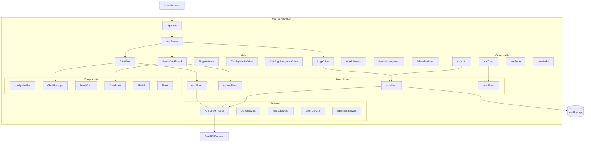
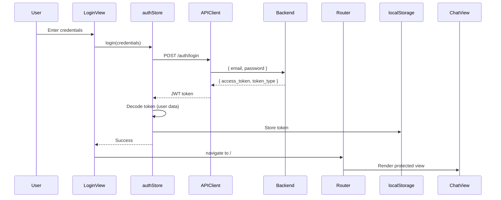
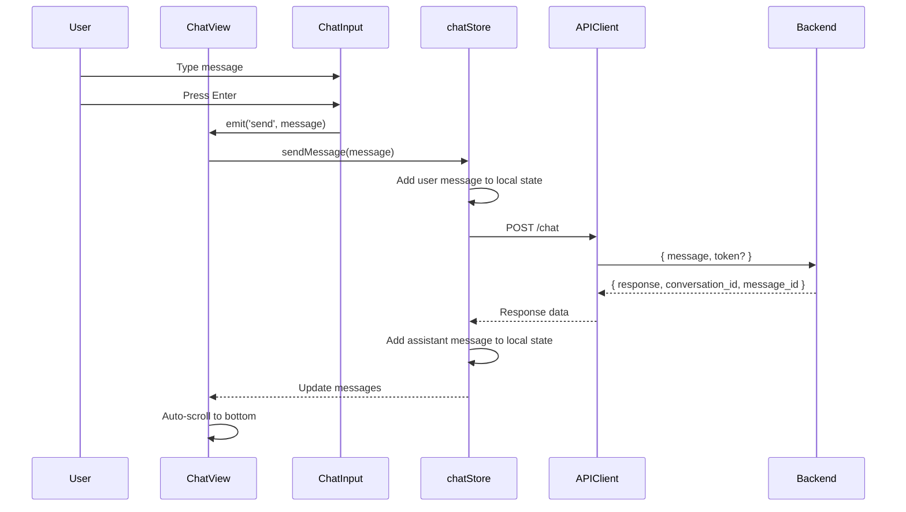
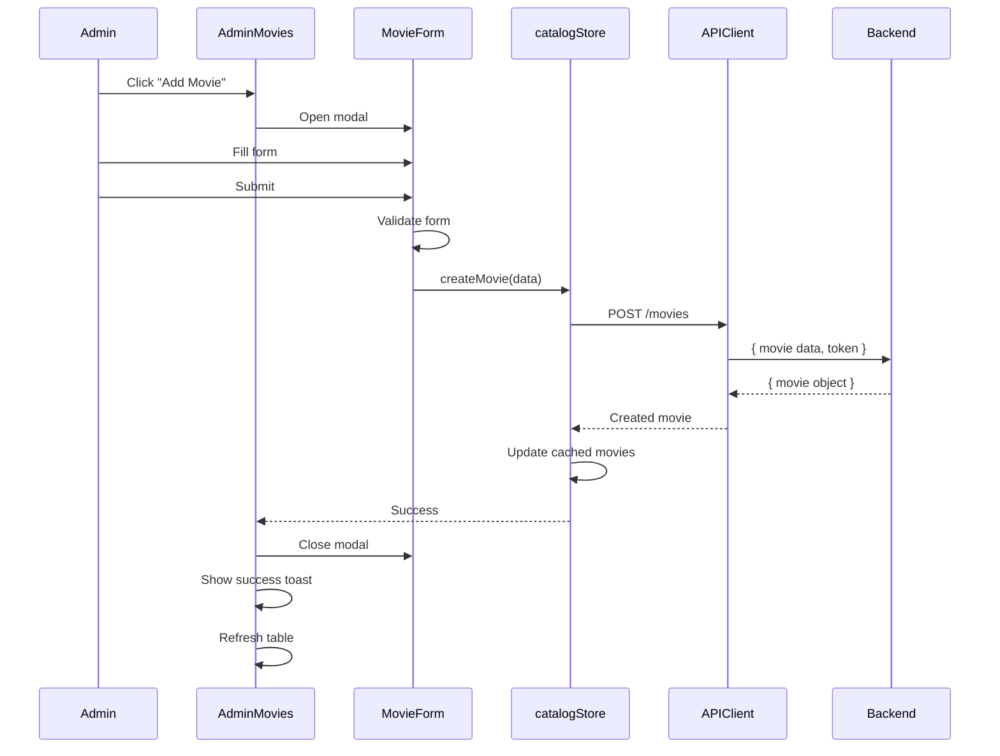
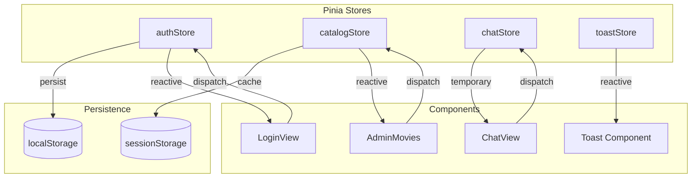

# Design Document: Vue.js 3 Frontend

## Overview

The Vue.js 3 Frontend is a modern single-page application (SPA) that provides an interactive user interface for the ChatbotOcio system. Built with Vue 3 Composition API, the application delivers a responsive, accessible experience for chatting with an AI assistant, browsing media catalogs, and managing content through an administrative dashboard.

**Core Capabilities:**
- JWT-based authentication with role-based UI
- Real-time chat interface with ChatGPT-inspired UX
- Public catalog browsing for movies and videogames
- Administrative dashboard for content management and analytics
- Responsive design supporting desktop, tablet, and mobile
- Persistent authentication state across sessions

**Key Design Principles:**
- Component-driven architecture with Vue 3 Composition API
- Centralized state management using Pinia stores
- API-first design with Axios client
- Utility-first styling with Tailwind CSS
- Accessibility-first approach with ARIA labels and keyboard navigation
- Progressive enhancement for optimal performance

**Technology Stack:**
- **Framework**: Vue 3.4+ with Composition API and `<script setup>`
- **Build Tool**: Vite 5+ for fast development and optimized builds
- **State Management**: Pinia 2+ for reactive global state
- **Router**: Vue Router 4+ with navigation guards
- **HTTP Client**: Axios 1.6+ with interceptors
- **Styling**: Tailwind CSS 3.4+ with custom theme
- **Icons**: Heroicons for consistent iconography

## Architecture

### High-Level Architecture



### Component Interaction Flow

**Authentication Flow:**


**Chat Flow:**


**CRUD Flow (Admin):**


### State Management Architecture



## Project Structure

```
ChatbotOcio/                                   # Project root
├── frontend/                                   # Frontend directory (Vue.js 3)
│   ├── src/
│   │   ├── main.js                            # Application entry point
│   │   ├── App.vue                            # Root component
│   │   │
│   │   ├── views/                             # Page-level components
│   │   │   ├── HomeView.vue                   # Home/Chat page (/)
│   │   │   ├── ChatView.vue                   # Dedicated chat page
│   │   │   ├── LoginView.vue                  # Login page
│   │   │   ├── RegisterView.vue               # Registration page
│   │   │   ├── CatalogMoviesView.vue          # Public movies catalog
│   │   │   ├── CatalogVideogamesView.vue      # Public videogames catalog
│   │   │   ├── AdminDashboardView.vue         # Admin dashboard home
│   │   │   ├── AdminMoviesView.vue            # Admin movies management
│   │   │   ├── AdminVideogamesView.vue        # Admin videogames management
│   │   │   └── AdminStatisticsView.vue        # Admin statistics
│   │   │
│   │   ├── components/                        # Reusable components
│   │   │   ├── layout/
│   │   │   │   ├── NavigationBar.vue          # Main navigation
│   │   │   │   ├── Sidebar.vue                # Admin sidebar
│   │   │   │   └── Footer.vue                 # Footer
│   │   │   │
│   │   │   ├── chat/
│   │   │   │   ├── ChatMessage.vue            # Single message bubble
│   │   │   │   ├── ChatInput.vue              # Message input field
│   │   │   │   ├── ChatHistory.vue            # Messages container
│   │   │   │   ├── TypingIndicator.vue        # "..." animation
│   │   │   │   └── WelcomeMessage.vue         # Initial welcome
│   │   │   │
│   │   │   ├── catalog/
│   │   │   │   ├── MovieCard.vue              # Movie display card
│   │   │   │   ├── VideogameCard.vue          # Videogame display card
│   │   │   │   ├── MediaGrid.vue              # Grid layout container
│   │   │   │   ├── MediaFilters.vue           # Filter dropdowns
│   │   │   │   ├── MediaDetail.vue            # Detail modal
│   │   │   │   └── Pagination.vue             # Pagination controls
│   │   │   │
│   │   │   ├── admin/
│   │   │   │   ├── DataTable.vue              # Generic data table
│   │   │   │   ├── MovieForm.vue              # Movie create/edit form
│   │   │   │   ├── VideogameForm.vue          # Videogame create/edit form
│   │   │   │   ├── StatsChart.vue             # Statistics chart
│   │   │   │   ├── StatsSummary.vue           # Summary cards
│   │   │   │   ├── UserStatsTable.vue         # User statistics table
│   │   │   │   └── DateRangePicker.vue        # Date range selector
│   │   │   │
│   │   │   ├── auth/
│   │   │   │   ├── LoginForm.vue              # Login form
│   │   │   │   ├── RegisterForm.vue           # Registration form
│   │   │   │   └── UserMenu.vue               # User dropdown menu
│   │   │   │
│   │   │   └── common/
│   │   │       ├── Modal.vue                  # Modal dialog
│   │   │       ├── Toast.vue                  # Toast notification
│   │   │       ├── Button.vue                 # Styled button
│   │   │       ├── Input.vue                  # Styled input
│   │   │       ├── Select.vue                 # Styled select
│   │   │       ├── LoadingSpinner.vue         # Loading spinner
│   │   │       ├── SkeletonLoader.vue         # Skeleton placeholder
│   │   │       ├── ConfirmDialog.vue          # Confirmation dialog
│   │   │       └── ErrorMessage.vue           # Error display
│   │   │
│   │   ├── stores/                            # Pinia stores
│   │   │   ├── index.js                       # Store configuration
│   │   │   ├── auth.js                        # Authentication store
│   │   │   ├── catalog.js                     # Catalog data store
│   │   │   ├── chat.js                        # Chat messages store
│   │   │   └── toast.js                       # Toast notifications store
│   │   │
│   │   ├── router/                            # Vue Router
│   │   │   ├── index.js                       # Router configuration
│   │   │   └── guards.js                      # Navigation guards
│   │   │
│   │   ├── services/                          # API services
│   │   │   ├── api.js                         # Axios client configuration
│   │   │   ├── auth.service.js                # Auth API calls
│   │   │   ├── media.service.js               # Movies/videogames API
│   │   │   ├── chat.service.js                # Chat API calls
│   │   │   └── statistics.service.js          # Statistics API calls
│   │   │
│   │   ├── composables/                       # Composition API composables
│   │   │   ├── useAuth.js                     # Auth helpers
│   │   │   ├── useToast.js                    # Toast helpers
│   │   │   ├── useForm.js                     # Form validation
│   │   │   ├── useModal.js                    # Modal control
│   │   │   ├── usePagination.js               # Pagination logic
│   │   │   └── useDebounce.js                 # Debounce utility
│   │   │
│   │   ├── utils/                             # Utility functions
│   │   │   ├── validation.js                  # Form validators
│   │   │   ├── formatters.js                  # Data formatters
│   │   │   ├── constants.js                   # App constants
│   │   │   └── helpers.js                     # Helper functions
│   │   │
│   │   └── assets/                            # Static assets
│   │       ├── styles/
│   │       │   ├── main.css                   # Main CSS + Tailwind imports
│   │       │   └── transitions.css            # Custom transitions
│   │       │
│   │       └── images/
│   │           ├── logo.svg
│   │           └── placeholder.png
│   │
│   ├── public/                                # Static files
│   │   ├── favicon.ico
│   │   └── robots.txt
│   │
│   ├── tests/                                 # Tests (optional structure)
│   │   ├── unit/
│   │   │   ├── components/
│   │   │   └── stores/
│   │   │
│   │   └── e2e/
│   │       └── flows/
│   │
│   ├── .env                                   # Environment variables (not in git)
│   ├── .env.example                           # Environment template
│   ├── .gitignore
│   ├── package.json                           # Dependencies
│   ├── package-lock.json
│   ├── vite.config.js                         # Vite configuration
│   ├── tailwind.config.js                     # Tailwind configuration
│   ├── postcss.config.js                      # PostCSS configuration
│   ├── jsconfig.json                          # JavaScript configuration
│   ├── .eslintrc.js                           # ESLint configuration
│   ├── .prettierrc                            # Prettier configuration
│   ├── vitest.config.js                       # Vitest configuration (optional)
│   └── README.md                              # Frontend documentation
│
└── README.md                                  # Project documentation
```

## Components Design

### Views

#### 1. HomeView.vue / ChatView.vue

**Purpose**: Main chat interface for interacting with the chatbot

**Template Structure**:
```vue
<template>
  <div class="flex flex-col h-screen">
    <NavigationBar />
    <main class="flex-1 overflow-hidden">
      <div class="container mx-auto h-full flex flex-col">
        <WelcomeMessage v-if="messages.length === 0" />
        <ChatHistory :messages="messages" class="flex-1" />
        <ChatInput @send="handleSendMessage" :disabled="loading" />
      </div>
    </main>
  </div>
</template>
```

**Script**:
```javascript
<script setup>
import { ref, computed } from 'vue'
import { useChatStore } from '@/stores/chat'
import { useToast } from '@/composables/useToast'

const chatStore = useChatStore()
const { showToast } = useToast()

const messages = computed(() => chatStore.messages)
const loading = computed(() => chatStore.loading)

const handleSendMessage = async (message) => {
  try {
    await chatStore.sendMessage(message)
  } catch (error) {
    showToast('Failed to send message. Please try again.', 'error')
  }
}
</script>
```

**Composables Used**: `useChatStore`, `useToast`

---

#### 2. LoginView.vue

**Purpose**: User authentication page

**Template Structure**:
```vue
<template>
  <div class="min-h-screen flex items-center justify-center bg-gray-50 py-12 px-4">
    <div class="max-w-md w-full space-y-8">
      <div class="text-center">
        <h2 class="text-3xl font-bold">Sign in to ChatbotOcio</h2>
        <p class="mt-2 text-gray-600">Or <router-link to="/register">create a new account</router-link></p>
      </div>
      <LoginForm @submit="handleLogin" :loading="loading" />
    </div>
  </div>
</template>
```

**Script**:
```javascript
<script setup>
import { ref } from 'vue'
import { useRouter } from 'vue-router'
import { useAuthStore } from '@/stores/auth'
import { useToast } from '@/composables/useToast'
import LoginForm from '@/components/auth/LoginForm.vue'

const router = useRouter()
const authStore = useAuthStore()
const { showToast } = useToast()
const loading = ref(false)

const handleLogin = async (credentials) => {
  loading.value = true
  try {
    await authStore.login(credentials)
    showToast('Login successful!', 'success')
    
    // Redirect to previous page or home
    const redirect = router.currentRoute.value.query.redirect || '/'
    router.push(redirect)
  } catch (error) {
    showToast(error.message || 'Login failed', 'error')
  } finally {
    loading.value = false
  }
}
</script>
```

**Composables Used**: `useAuthStore`, `useToast`, `useRouter`

---

#### 3. RegisterView.vue

**Purpose**: User registration page

**Template Structure**:
```vue
<template>
  <div class="min-h-screen flex items-center justify-center bg-gray-50 py-12 px-4">
    <div class="max-w-md w-full space-y-8">
      <div class="text-center">
        <h2 class="text-3xl font-bold">Create your account</h2>
        <p class="mt-2 text-gray-600">Already have an account? <router-link to="/login">Sign in</router-link></p>
      </div>
      <RegisterForm @submit="handleRegister" :loading="loading" />
    </div>
  </div>
</template>
```

**Script**: Similar to LoginView with registration logic

**Composables Used**: `useAuthStore`, `useToast`, `useRouter`

---

#### 4. CatalogMoviesView.vue

**Purpose**: Public movie catalog browsing

**Template Structure**:
```vue
<template>
  <div class="min-h-screen bg-gray-50">
    <NavigationBar />
    <main class="container mx-auto px-4 py-8">
      <div class="mb-8">
        <h1 class="text-3xl font-bold mb-4">Movies Catalog</h1>
        <MediaFilters 
          :genres="genres"
          :platforms="platforms"
          :years="years"
          @filter="handleFilter"
        />
      </div>
      
      <SkeletonLoader v-if="loading" />
      
      <MediaGrid v-else-if="movies.length > 0">
        <MovieCard 
          v-for="movie in movies" 
          :key="movie.id_pelicula"
          :movie="movie"
          @click="showDetail(movie)"
        />
      </MediaGrid>
      
      <div v-else class="text-center py-12">
        <p class="text-gray-500">No movies found</p>
      </div>
      
      <Pagination 
        v-if="totalPages > 1"
        :current-page="currentPage"
        :total-pages="totalPages"
        @change="handlePageChange"
      />
    </main>
    
    <MediaDetail 
      v-if="selectedMovie"
      :media="selectedMovie"
      @close="selectedMovie = null"
    />
  </div>
</template>
```

**Script**:
```javascript
<script setup>
import { ref, computed, onMounted } from 'vue'
import { useCatalogStore } from '@/stores/catalog'
import { useToast } from '@/composables/useToast'
import { usePagination } from '@/composables/usePagination'

const catalogStore = useCatalogStore()
const { showToast } = useToast()

const loading = ref(false)
const selectedMovie = ref(null)
const filters = ref({
  genero: null,
  plataforma: null,
  anio_lanzamiento: null
})

const movies = computed(() => catalogStore.movies)
const { currentPage, totalPages, handlePageChange } = usePagination()

const genres = computed(() => [...new Set(movies.value.map(m => m.genero))])
const platforms = computed(() => [...new Set(movies.value.map(m => m.plataforma))])
const years = computed(() => [...new Set(movies.value.map(m => m.anio_lanzamiento))])

const fetchMovies = async () => {
  loading.value = true
  try {
    await catalogStore.fetchMovies({
      ...filters.value,
      page: currentPage.value
    })
  } catch (error) {
    showToast('Failed to load movies', 'error')
  } finally {
    loading.value = false
  }
}

const handleFilter = (newFilters) => {
  filters.value = newFilters
  currentPage.value = 1
  fetchMovies()
}

const showDetail = (movie) => {
  selectedMovie.value = movie
}

onMounted(() => {
  fetchMovies()
})
</script>
```

**Composables Used**: `useCatalogStore`, `useToast`, `usePagination`

---

#### 5. CatalogVideogamesView.vue

**Purpose**: Public videogame catalog browsing

**Template Structure**: Similar to CatalogMoviesView but for videogames

**Script**: Similar logic with videogame-specific fields

**Composables Used**: `useCatalogStore`, `useToast`, `usePagination`

---

#### 6. AdminDashboardView.vue

**Purpose**: Admin dashboard home with overview

**Template Structure**:
```vue
<template>
  <div class="min-h-screen bg-gray-50">
    <NavigationBar />
    <div class="flex">
      <Sidebar />
      <main class="flex-1 p-8">
        <h1 class="text-3xl font-bold mb-8">Admin Dashboard</h1>
        
        <div class="grid grid-cols-1 md:grid-cols-3 gap-6 mb-8">
          <StatsSummary 
            title="Total Movies" 
            :value="stats.totalMovies"
            icon="film"
          />
          <StatsSummary 
            title="Total Videogames" 
            :value="stats.totalVideogames"
            icon="puzzle"
          />
          <StatsSummary 
            title="Total Users" 
            :value="stats.totalUsers"
            icon="users"
          />
        </div>
        
        <div class="grid grid-cols-1 lg:grid-cols-2 gap-8">
          <div class="bg-white p-6 rounded-lg shadow">
            <h2 class="text-xl font-bold mb-4">Recent Activity</h2>
            <!-- Activity list -->
          </div>
          
          <div class="bg-white p-6 rounded-lg shadow">
            <h2 class="text-xl font-bold mb-4">Quick Actions</h2>
            <div class="space-y-3">
              <router-link to="/admin/movies" class="block p-3 bg-blue-50 rounded hover:bg-blue-100">
                Manage Movies
              </router-link>
              <router-link to="/admin/videogames" class="block p-3 bg-blue-50 rounded hover:bg-blue-100">
                Manage Videogames
              </router-link>
              <router-link to="/admin/statistics" class="block p-3 bg-blue-50 rounded hover:bg-blue-100">
                View Statistics
              </router-link>
            </div>
          </div>
        </div>
      </main>
    </div>
  </div>
</template>
```

**Script**: Fetches summary statistics for display

**Composables Used**: `useCatalogStore`, `useAuthStore`

---

#### 7. AdminMoviesView.vue

**Purpose**: Admin interface for movie management

**Template Structure**:
```vue
<template>
  <div class="min-h-screen bg-gray-50">
    <NavigationBar />
    <div class="flex">
      <Sidebar />
      <main class="flex-1 p-8">
        <div class="flex justify-between items-center mb-8">
          <h1 class="text-3xl font-bold">Manage Movies</h1>
          <Button @click="openCreateModal" variant="primary">
            Add Movie
          </Button>
        </div>
        
        <div class="bg-white rounded-lg shadow">
          <div class="p-4 border-b">
            <Input 
              v-model="searchQuery" 
              placeholder="Search movies..."
              @input="handleSearch"
            />
          </div>
          
          <DataTable
            :columns="columns"
            :data="movies"
            :loading="loading"
            @edit="openEditModal"
            @delete="confirmDelete"
          />
          
          <div class="p-4 border-t">
            <Pagination 
              :current-page="currentPage"
              :total-pages="totalPages"
              @change="handlePageChange"
            />
          </div>
        </div>
      </main>
    </div>
    
    <Modal v-if="showModal" @close="closeModal">
      <MovieForm
        :movie="selectedMovie"
        :mode="formMode"
        @submit="handleSubmit"
        @cancel="closeModal"
      />
    </Modal>
    
    <ConfirmDialog
      v-if="showConfirmDialog"
      title="Delete Movie"
      message="Are you sure you want to delete this movie?"
      @confirm="handleDelete"
      @cancel="showConfirmDialog = false"
    />
  </div>
</template>
```

**Script**:
```javascript
<script setup>
import { ref, computed, onMounted } from 'vue'
import { useCatalogStore } from '@/stores/catalog'
import { useToast } from '@/composables/useToast'
import { useModal } from '@/composables/useModal'
import { useDebounce } from '@/composables/useDebounce'

const catalogStore = useCatalogStore()
const { showToast } = useToast()
const { showModal, openModal, closeModal } = useModal()

const loading = ref(false)
const searchQuery = ref('')
const selectedMovie = ref(null)
const formMode = ref('create') // 'create' | 'edit'
const showConfirmDialog = ref(false)
const movieToDelete = ref(null)

const movies = computed(() => catalogStore.movies)
const currentPage = ref(1)
const totalPages = computed(() => catalogStore.moviesPagination.totalPages)

const columns = [
  { key: 'titulo', label: 'Title' },
  { key: 'genero', label: 'Genre' },
  { key: 'plataforma', label: 'Platform' },
  { key: 'anio_lanzamiento', label: 'Year' },
  { key: 'director', label: 'Director' },
  { key: 'actions', label: 'Actions' }
]

const fetchMovies = async () => {
  loading.value = true
  try {
    await catalogStore.fetchMoviesAdmin({
      page: currentPage.value,
      search: searchQuery.value
    })
  } catch (error) {
    showToast('Failed to load movies', 'error')
  } finally {
    loading.value = false
  }
}

const handleSearch = useDebounce(() => {
  currentPage.value = 1
  fetchMovies()
}, 300)

const openCreateModal = () => {
  selectedMovie.value = null
  formMode.value = 'create'
  openModal()
}

const openEditModal = (movie) => {
  selectedMovie.value = movie
  formMode.value = 'edit'
  openModal()
}

const handleSubmit = async (movieData) => {
  try {
    if (formMode.value === 'create') {
      await catalogStore.createMovie(movieData)
      showToast('Movie created successfully', 'success')
    } else {
      await catalogStore.updateMovie(selectedMovie.value.id_pelicula, movieData)
      showToast('Movie updated successfully', 'success')
    }
    closeModal()
    fetchMovies()
  } catch (error) {
    showToast(error.message || 'Operation failed', 'error')
  }
}

const confirmDelete = (movie) => {
  movieToDelete.value = movie
  showConfirmDialog.value = true
}

const handleDelete = async () => {
  try {
    await catalogStore.deleteMovie(movieToDelete.value.id_pelicula)
    showToast('Movie deleted successfully', 'success')
    showConfirmDialog.value = false
    fetchMovies()
  } catch (error) {
    showToast('Failed to delete movie', 'error')
  }
}

const handlePageChange = (page) => {
  currentPage.value = page
  fetchMovies()
}

onMounted(() => {
  fetchMovies()
})
</script>
```

**Composables Used**: `useCatalogStore`, `useToast`, `useModal`, `useDebounce`

---

#### 8. AdminVideogamesView.vue

**Purpose**: Admin interface for videogame management

**Template Structure**: Similar to AdminMoviesView but for videogames

**Script**: Similar logic with videogame-specific fields and validation

**Composables Used**: `useCatalogStore`, `useToast`, `useModal`, `useDebounce`

---

#### 9. AdminStatisticsView.vue

**Purpose**: Token consumption analytics and statistics

**Template Structure**:
```vue
<template>
  <div class="min-h-screen bg-gray-50">
    <NavigationBar />
    <div class="flex">
      <Sidebar />
      <main class="flex-1 p-8">
        <div class="flex justify-between items-center mb-8">
          <h1 class="text-3xl font-bold">Statistics</h1>
          <DateRangePicker 
            v-model:start="dateRange.start"
            v-model:end="dateRange.end"
            @change="fetchStatistics"
          />
        </div>
        
        <div class="grid grid-cols-1 md:grid-cols-3 gap-6 mb-8">
          <StatsSummary 
            title="Total Tokens" 
            :value="stats.totalTokens"
            icon="cpu"
          />
          <StatsSummary 
            title="Total Messages" 
            :value="stats.totalMessages"
            icon="chat"
          />
          <StatsSummary 
            title="Active Users" 
            :value="stats.totalUsers"
            icon="users"
          />
        </div>
        
        <div class="bg-white rounded-lg shadow p-6 mb-8">
          <h2 class="text-xl font-bold mb-4">Token Consumption Over Time</h2>
          <StatsChart 
            :data="stats.dailyStats"
            type="line"
            :loading="loading"
          />
        </div>
        
        <div class="bg-white rounded-lg shadow p-6">
          <h2 class="text-xl font-bold mb-4">Top Users by Token Consumption</h2>
          <UserStatsTable 
            :users="stats.userStats"
            :loading="loading"
          />
        </div>
      </main>
    </div>
  </div>
</template>
```

**Script**:
```javascript
<script setup>
import { ref, computed, onMounted } from 'vue'
import { useStatisticsStore } from '@/stores/statistics'
import { useToast } from '@/composables/useToast'

const statisticsStore = useStatisticsStore()
const { showToast } = useToast()

const loading = ref(false)
const dateRange = ref({
  start: new Date(Date.now() - 30 * 24 * 60 * 60 * 1000), // 30 days ago
  end: new Date()
})

const stats = computed(() => statisticsStore.statistics)

const fetchStatistics = async () => {
  loading.value = true
  try {
    await statisticsStore.fetchStatistics({
      start_date: dateRange.value.start.toISOString().split('T')[0],
      end_date: dateRange.value.end.toISOString().split('T')[0]
    })
  } catch (error) {
    showToast('Failed to load statistics', 'error')
  } finally {
    loading.value = false
  }
}

onMounted(() => {
  fetchStatistics()
})
</script>
```

**Composables Used**: `useStatisticsStore`, `useToast`

---

### Reusable Components

#### Chat Components

##### ChatMessage.vue

**Props**:
```javascript
{
  message: {
    type: Object,
    required: true,
    // { role: 'user' | 'assistant', contenido: string, fecha: string }
  }
}
```

**Template**:
```vue
<template>
  <div 
    :class="[
      'flex mb-4',
      message.rol === 'user' ? 'justify-end' : 'justify-start'
    ]"
  >
    <div 
      :class="[
        'max-w-[70%] rounded-lg px-4 py-2',
        message.rol === 'user' 
          ? 'bg-blue-600 text-white' 
          : 'bg-gray-200 text-gray-900'
      ]"
    >
      <div class="text-sm" v-html="formattedContent"></div>
      <div class="text-xs opacity-70 mt-1">
        {{ formattedTime }}
      </div>
    </div>
  </div>
</template>

<script setup>
import { computed } from 'vue'
import { formatTime, linkifyText } from '@/utils/formatters'

const props = defineProps({
  message: {
    type: Object,
    required: true
  }
})

const formattedContent = computed(() => {
  return linkifyText(props.message.contenido)
})

const formattedTime = computed(() => {
  return formatTime(props.message.fecha)
})
</script>
```

---

##### ChatInput.vue

**Props**:
```javascript
{
  disabled: {
    type: Boolean,
    default: false
  }
}
```

**Emits**: `send(message: string)`

**Template**:
```vue
<template>
  <div class="border-t bg-white p-4">
    <div class="flex items-end space-x-2">
      <textarea
        v-model="message"
        @keydown="handleKeydown"
        placeholder="Type your message..."
        rows="1"
        class="flex-1 resize-none rounded-lg border border-gray-300 px-4 py-2 focus:outline-none focus:ring-2 focus:ring-blue-500"
        :disabled="disabled"
        :maxlength="10000"
        ref="textareaRef"
      />
      <Button
        @click="sendMessage"
        :disabled="!canSend"
        variant="primary"
        class="px-6"
      >
        <span v-if="!disabled">Send</span>
        <LoadingSpinner v-else />
      </Button>
    </div>
    <div class="text-xs text-gray-500 mt-1 text-right">
      {{ message.length }} / 10000
    </div>
  </div>
</template>

<script setup>
import { ref, computed, watch } from 'vue'

const props = defineProps({
  disabled: {
    type: Boolean,
    default: false
  }
})

const emit = defineEmits(['send'])

const message = ref('')
const textareaRef = ref(null)

const canSend = computed(() => {
  return message.value.trim().length > 0 && !props.disabled
})

const sendMessage = () => {
  if (!canSend.value) return
  
  emit('send', message.value.trim())
  message.value = ''
  
  // Reset textarea height
  if (textareaRef.value) {
    textareaRef.value.style.height = 'auto'
  }
}

const handleKeydown = (e) => {
  if (e.key === 'Enter' && !e.shiftKey) {
    e.preventDefault()
    sendMessage()
  }
  
  // Auto-resize textarea
  if (textareaRef.value) {
    textareaRef.value.style.height = 'auto'
    textareaRef.value.style.height = `${textareaRef.value.scrollHeight}px`
  }
}

// Focus input on mount
watch(() => props.disabled, (isDisabled) => {
  if (!isDisabled && textareaRef.value) {
    textareaRef.value.focus()
  }
})
</script>
```

---

##### ChatHistory.vue

**Props**:
```javascript
{
  messages: {
    type: Array,
    required: true
  }
}
```

**Template**:
```vue
<template>
  <div 
    ref="historyRef"
    class="flex-1 overflow-y-auto p-4 space-y-4"
  >
    <ChatMessage
      v-for="(message, index) in messages"
      :key="index"
      :message="message"
    />
    <TypingIndicator v-if="isTyping" />
  </div>
</template>

<script setup>
import { ref, watch, nextTick } from 'vue'

const props = defineProps({
  messages: {
    type: Array,
    required: true
  }
})

const historyRef = ref(null)
const isTyping = ref(false)

const scrollToBottom = () => {
  nextTick(() => {
    if (historyRef.value) {
      historyRef.value.scrollTop = historyRef.value.scrollHeight
    }
  })
}

watch(() => props.messages, () => {
  scrollToBottom()
}, { deep: true })
</script>
```

---

#### Catalog Components

##### MovieCard.vue

**Props**:
```javascript
{
  movie: {
    type: Object,
    required: true
  }
}
```

**Emits**: `click`

**Template**:
```vue
<template>
  <div 
    class="bg-white rounded-lg shadow-md overflow-hidden cursor-pointer transition-transform hover:scale-105"
    @click="$emit('click')"
  >
    <div class="p-4">
      <h3 class="font-bold text-lg mb-2 truncate">{{ movie.titulo }}</h3>
      
      <div class="space-y-1 text-sm text-gray-600">
        <div class="flex items-center">
          <span class="font-medium">Genre:</span>
          <span class="ml-2">{{ movie.genero }}</span>
        </div>
        
        <div class="flex items-center">
          <span class="font-medium">Year:</span>
          <span class="ml-2">{{ movie.anio_lanzamiento }}</span>
        </div>
        
        <div class="flex items-center">
          <span class="font-medium">Platform:</span>
          <span class="ml-2">{{ movie.plataforma }}</span>
        </div>
        
        <div v-if="movie.calificacion" class="flex items-center">
          <span class="font-medium">Rating:</span>
          <span class="ml-2">{{ movie.calificacion }}/10</span>
        </div>
      </div>
    </div>
  </div>
</template>

<script setup>
defineProps({
  movie: {
    type: Object,
    required: true
  }
})

defineEmits(['click'])
</script>
```

---

##### VideogameCard.vue

**Props**: Similar to MovieCard but for videogames

**Template**: Similar structure with videogame-specific fields (clasificacion, desarrollador, jugadores)

---

##### MediaFilters.vue

**Props**:
```javascript
{
  genres: { type: Array, default: () => [] },
  platforms: { type: Array, default: () => [] },
  years: { type: Array, default: () => [] }
}
```

**Emits**: `filter(filters: object)`

**Template**:
```vue
<template>
  <div class="bg-white rounded-lg shadow p-4">
    <div class="grid grid-cols-1 md:grid-cols-4 gap-4">
      <Select
        v-model="selectedGenre"
        :options="genreOptions"
        placeholder="All Genres"
        @change="emitFilters"
      />
      
      <Select
        v-model="selectedPlatform"
        :options="platformOptions"
        placeholder="All Platforms"
        @change="emitFilters"
      />
      
      <Select
        v-model="selectedYear"
        :options="yearOptions"
        placeholder="All Years"
        @change="emitFilters"
      />
      
      <Button @click="clearFilters" variant="secondary">
        Clear Filters
      </Button>
    </div>
  </div>
</template>

<script setup>
import { ref, computed } from 'vue'

const props = defineProps({
  genres: { type: Array, default: () => [] },
  platforms: { type: Array, default: () => [] },
  years: { type: Array, default: () => [] }
})

const emit = defineEmits(['filter'])

const selectedGenre = ref(null)
const selectedPlatform = ref(null)
const selectedYear = ref(null)

const genreOptions = computed(() => 
  [{ value: null, label: 'All Genres' }, ...props.genres.map(g => ({ value: g, label: g }))]
)

const platformOptions = computed(() => 
  [{ value: null, label: 'All Platforms' }, ...props.platforms.map(p => ({ value: p, label: p }))]
)

const yearOptions = computed(() => 
  [{ value: null, label: 'All Years' }, ...props.years.map(y => ({ value: y, label: y }))]
)

const emitFilters = () => {
  emit('filter', {
    genero: selectedGenre.value,
    plataforma: selectedPlatform.value,
    anio_lanzamiento: selectedYear.value
  })
}

const clearFilters = () => {
  selectedGenre.value = null
  selectedPlatform.value = null
  selectedYear.value = null
  emitFilters()
}
</script>
```

---

#### Admin Components

##### DataTable.vue

**Props**:
```javascript
{
  columns: {
    type: Array,
    required: true,
    // [{ key: string, label: string, sortable?: boolean }]
  },
  data: {
    type: Array,
    required: true
  },
  loading: {
    type: Boolean,
    default: false
  }
}
```

**Emits**: `edit(item)`, `delete(item)`, `sort(column)`

**Template**:
```vue
<template>
  <div class="overflow-x-auto">
    <table class="min-w-full divide-y divide-gray-200">
      <thead class="bg-gray-50">
        <tr>
          <th
            v-for="column in columns"
            :key="column.key"
            class="px-6 py-3 text-left text-xs font-medium text-gray-500 uppercase tracking-wider"
          >
            <div class="flex items-center space-x-1">
              <span>{{ column.label }}</span>
              <button
                v-if="column.sortable"
                @click="$emit('sort', column.key)"
                class="hover:text-gray-700"
              >
                ↕
              </button>
            </div>
          </th>
        </tr>
      </thead>
      
      <tbody class="bg-white divide-y divide-gray-200">
        <tr v-if="loading">
          <td :colspan="columns.length" class="px-6 py-4 text-center">
            <LoadingSpinner />
          </td>
        </tr>
        
        <tr 
          v-else
          v-for="(item, index) in data"
          :key="index"
          class="hover:bg-gray-50"
        >
          <td
            v-for="column in columns"
            :key="column.key"
            class="px-6 py-4 whitespace-nowrap text-sm"
          >
            <template v-if="column.key === 'actions'">
              <div class="flex space-x-2">
                <Button
                  @click="$emit('edit', item)"
                  variant="secondary"
                  size="sm"
                >
                  Edit
                </Button>
                <Button
                  @click="$emit('delete', item)"
                  variant="danger"
                  size="sm"
                >
                  Delete
                </Button>
              </div>
            </template>
            <template v-else>
              {{ item[column.key] }}
            </template>
          </td>
        </tr>
        
        <tr v-if="!loading && data.length === 0">
          <td :colspan="columns.length" class="px-6 py-4 text-center text-gray-500">
            No data available
          </td>
        </tr>
      </tbody>
    </table>
  </div>
</template>

<script setup>
defineProps({
  columns: {
    type: Array,
    required: true
  },
  data: {
    type: Array,
    required: true
  },
  loading: {
    type: Boolean,
    default: false
  }
})

defineEmits(['edit', 'delete', 'sort'])
</script>
```

---

##### MovieForm.vue

**Props**:
```javascript
{
  movie: {
    type: Object,
    default: null
  },
  mode: {
    type: String,
    default: 'create', // 'create' | 'edit'
    validator: (value) => ['create', 'edit'].includes(value)
  }
}
```

**Emits**: `submit(movieData)`, `cancel`

**Template**:
```vue
<template>
  <form @submit.prevent="handleSubmit" class="space-y-4">
    <h2 class="text-2xl font-bold">
      {{ mode === 'create' ? 'Add New Movie' : 'Edit Movie' }}
    </h2>
    
    <Input
      v-model="formData.titulo"
      label="Title"
      required
      :error="errors.titulo"
    />
    
    <Input
      v-model="formData.productora"
      label="Production Company"
      required
      :error="errors.productora"
    />
    
    <div class="grid grid-cols-2 gap-4">
      <Input
        v-model="formData.genero"
        label="Genre"
        required
        :error="errors.genero"
      />
      
      <Input
        v-model="formData.plataforma"
        label="Platform"
        required
        :error="errors.plataforma"
      />
    </div>
    
    <div class="grid grid-cols-2 gap-4">
      <Input
        v-model.number="formData.anio_lanzamiento"
        label="Release Year"
        type="number"
        required
        :min="1888"
        :max="new Date().getFullYear() + 5"
        :error="errors.anio_lanzamiento"
      />
      
      <Input
        v-model.number="formData.calificacion"
        label="Rating (0-10)"
        type="number"
        step="0.1"
        :min="0"
        :max="10"
        :error="errors.calificacion"
      />
    </div>
    
    <Input
      v-model="formData.director"
      label="Director"
      required
      :error="errors.director"
    />
    
    <Input
      v-model="formData.actores"
      label="Actors (comma-separated, max 10)"
      :error="errors.actores"
    />
    
    <div class="grid grid-cols-2 gap-4">
      <Input
        v-model.number="formData.duracion_minutos"
        label="Duration (minutes)"
        type="number"
        required
        :min="1"
        :max="1000"
        :error="errors.duracion_minutos"
      />
      
      <Input
        v-model="formData.clasificacion"
        label="Classification"
        required
        :error="errors.clasificacion"
      />
    </div>
    
    <div class="flex justify-end space-x-3">
      <Button @click="$emit('cancel')" variant="secondary">
        Cancel
      </Button>
      <Button type="submit" variant="primary" :disabled="submitting">
        {{ mode === 'create' ? 'Create' : 'Update' }}
      </Button>
    </div>
  </form>
</template>

<script setup>
import { ref, reactive, watch } from 'vue'
import { useForm } from '@/composables/useForm'
import { validateMovie } from '@/utils/validation'

const props = defineProps({
  movie: {
    type: Object,
    default: null
  },
  mode: {
    type: String,
    default: 'create'
  }
})

const emit = defineEmits(['submit', 'cancel'])

const formData = reactive({
  titulo: '',
  productora: '',
  genero: '',
  plataforma: '',
  anio_lanzamiento: new Date().getFullYear(),
  calificacion: null,
  director: '',
  actores: '',
  duracion_minutos: null,
  clasificacion: ''
})

const { errors, validate, submitting } = useForm(validateMovie)

// Initialize form with existing movie data if editing
watch(() => props.movie, (movie) => {
  if (movie && props.mode === 'edit') {
    Object.assign(formData, movie)
  }
}, { immediate: true })

const handleSubmit = async () => {
  submitting.value = true
  
  const isValid = validate(formData)
  if (!isValid) {
    submitting.value = false
    return
  }
  
  emit('submit', { ...formData })
  submitting.value = false
}
</script>
```

---

##### VideogameForm.vue

**Props**: Similar to MovieForm but for videogames

**Template**: Similar structure with videogame-specific fields and validation

---

##### StatsChart.vue

**Props**:
```javascript
{
  data: {
    type: Array,
    required: true,
    // [{ date: string, total_tokens: number, message_count: number }]
  },
  type: {
    type: String,
    default: 'line',
    validator: (value) => ['line', 'bar'].includes(value)
  },
  loading: {
    type: Boolean,
    default: false
  }
}
```

**Template**:
```vue
<template>
  <div class="w-full h-64">
    <LoadingSpinner v-if="loading" />
    <canvas v-else ref="chartRef"></canvas>
  </div>
</template>

<script setup>
import { ref, watch, onMounted } from 'vue'
import { Chart, registerables } from 'chart.js'

Chart.register(...registerables)

const props = defineProps({
  data: {
    type: Array,
    required: true
  },
  type: {
    type: String,
    default: 'line'
  },
  loading: {
    type: Boolean,
    default: false
  }
})

const chartRef = ref(null)
let chartInstance = null

const initChart = () => {
  if (!chartRef.value || props.loading) return
  
  // Destroy existing chart
  if (chartInstance) {
    chartInstance.destroy()
  }
  
  const ctx = chartRef.value.getContext('2d')
  
  chartInstance = new Chart(ctx, {
    type: props.type,
    data: {
      labels: props.data.map(d => d.date),
      datasets: [
        {
          label: 'Total Tokens',
          data: props.data.map(d => d.total_tokens),
          borderColor: 'rgb(59, 130, 246)',
          backgroundColor: 'rgba(59, 130, 246, 0.1)',
          tension: 0.4
        },
        {
          label: 'Message Count',
          data: props.data.map(d => d.message_count),
          borderColor: 'rgb(16, 185, 129)',
          backgroundColor: 'rgba(16, 185, 129, 0.1)',
          tension: 0.4,
          yAxisID: 'y1'
        }
      ]
    },
    options: {
      responsive: true,
      maintainAspectRatio: false,
      scales: {
        y: {
          beginAtZero: true,
          position: 'left',
          title: {
            display: true,
            text: 'Tokens'
          }
        },
        y1: {
          beginAtZero: true,
          position: 'right',
          title: {
            display: true,
            text: 'Messages'
          },
          grid: {
            drawOnChartArea: false
          }
        }
      }
    }
  })
}

watch(() => props.data, () => {
  initChart()
}, { deep: true })

onMounted(() => {
  initChart()
})
</script>
```

---

#### Common Components

##### Modal.vue

**Props**:
```javascript
{
  title: {
    type: String,
    default: ''
  },
  size: {
    type: String,
    default: 'md', // 'sm' | 'md' | 'lg' | 'xl'
    validator: (value) => ['sm', 'md', 'lg', 'xl'].includes(value)
  }
}
```

**Emits**: `close`

**Template**:
```vue
<template>
  <Transition name="modal">
    <div 
      class="fixed inset-0 z-50 overflow-y-auto"
      @click.self="$emit('close')"
    >
      <div class="flex min-h-screen items-center justify-center p-4">
        <div 
          class="fixed inset-0 bg-black opacity-50"
          @click="$emit('close')"
        ></div>
        
        <div 
          :class="[
            'relative bg-white rounded-lg shadow-xl w-full',
            sizeClasses
          ]"
        >
          <div class="flex items-center justify-between p-4 border-b">
            <h3 v-if="title" class="text-xl font-bold">{{ title }}</h3>
            <button
              @click="$emit('close')"
              class="text-gray-400 hover:text-gray-600"
            >
              <svg class="w-6 h-6" fill="none" stroke="currentColor" viewBox="0 0 24 24">
                <path stroke-linecap="round" stroke-linejoin="round" stroke-width="2" d="M6 18L18 6M6 6l12 12" />
              </svg>
            </button>
          </div>
          
          <div class="p-6">
            <slot></slot>
          </div>
        </div>
      </div>
    </div>
  </Transition>
</template>

<script setup>
import { computed } from 'vue'

const props = defineProps({
  title: {
    type: String,
    default: ''
  },
  size: {
    type: String,
    default: 'md'
  }
})

defineEmits(['close'])

const sizeClasses = computed(() => {
  const sizes = {
    sm: 'max-w-md',
    md: 'max-w-2xl',
    lg: 'max-w-4xl',
    xl: 'max-w-6xl'
  }
  return sizes[props.size]
})
</script>

<style scoped>
.modal-enter-active,
.modal-leave-active {
  transition: opacity 0.3s ease;
}

.modal-enter-from,
.modal-leave-to {
  opacity: 0;
}
</style>
```

---

##### Toast.vue

**Props**:
```javascript
{
  message: {
    type: String,
    required: true
  },
  type: {
    type: String,
    default: 'info',
    validator: (value) => ['success', 'error', 'warning', 'info'].includes(value)
  },
  duration: {
    type: Number,
    default: 3000
  }
}
```

**Emits**: `close`

**Template**:
```vue
<template>
  <Transition name="toast">
    <div 
      v-if="visible"
      :class="[
        'fixed top-4 right-4 max-w-md p-4 rounded-lg shadow-lg z-50',
        typeClasses
      ]"
    >
      <div class="flex items-start">
        <div class="flex-shrink-0">
          <component :is="iconComponent" class="w-6 h-6" />
        </div>
        <div class="ml-3 flex-1">
          <p class="text-sm font-medium">{{ message }}</p>
        </div>
        <button
          @click="close"
          class="ml-4 flex-shrink-0 text-current opacity-70 hover:opacity-100"
        >
          ✕
        </button>
      </div>
    </div>
  </Transition>
</template>

<script setup>
import { ref, computed, onMounted } from 'vue'
import { CheckCircleIcon, XCircleIcon, ExclamationCircleIcon, InformationCircleIcon } from '@heroicons/vue/24/outline'

const props = defineProps({
  message: {
    type: String,
    required: true
  },
  type: {
    type: String,
    default: 'info'
  },
  duration: {
    type: Number,
    default: 3000
  }
})

const emit = defineEmits(['close'])

const visible = ref(true)

const typeClasses = computed(() => {
  const classes = {
    success: 'bg-green-50 text-green-800 border-l-4 border-green-500',
    error: 'bg-red-50 text-red-800 border-l-4 border-red-500',
    warning: 'bg-yellow-50 text-yellow-800 border-l-4 border-yellow-500',
    info: 'bg-blue-50 text-blue-800 border-l-4 border-blue-500'
  }
  return classes[props.type]
})

const iconComponent = computed(() => {
  const icons = {
    success: CheckCircleIcon,
    error: XCircleIcon,
    warning: ExclamationCircleIcon,
    info: InformationCircleIcon
  }
  return icons[props.type]
})

const close = () => {
  visible.value = false
  setTimeout(() => emit('close'), 300)
}

onMounted(() => {
  if (props.duration > 0) {
    setTimeout(close, props.duration)
  }
})
</script>

<style scoped>
.toast-enter-active,
.toast-leave-active {
  transition: all 0.3s ease;
}

.toast-enter-from {
  transform: translateX(100%);
  opacity: 0;
}

.toast-leave-to {
  transform: translateY(-20px);
  opacity: 0;
}
</style>
```

---

##### Button.vue

**Props**:
```javascript
{
  variant: {
    type: String,
    default: 'primary',
    validator: (value) => ['primary', 'secondary', 'danger', 'ghost'].includes(value)
  },
  size: {
    type: String,
    default: 'md',
    validator: (value) => ['sm', 'md', 'lg'].includes(value)
  },
  disabled: {
    type: Boolean,
    default: false
  }
}
```

**Template**:
```vue
<template>
  <button
    :class="[
      'rounded-lg font-medium transition-colors focus:outline-none focus:ring-2 focus:ring-offset-2',
      variantClasses,
      sizeClasses,
      disabled && 'opacity-50 cursor-not-allowed'
    ]"
    :disabled="disabled"
  >
    <slot></slot>
  </button>
</template>

<script setup>
import { computed } from 'vue'

const props = defineProps({
  variant: {
    type: String,
    default: 'primary'
  },
  size: {
    type: String,
    default: 'md'
  },
  disabled: {
    type: Boolean,
    default: false
  }
})

const variantClasses = computed(() => {
  const variants = {
    primary: 'bg-blue-600 text-white hover:bg-blue-700 focus:ring-blue-500',
    secondary: 'bg-gray-200 text-gray-900 hover:bg-gray-300 focus:ring-gray-500',
    danger: 'bg-red-600 text-white hover:bg-red-700 focus:ring-red-500',
    ghost: 'bg-transparent text-gray-700 hover:bg-gray-100 focus:ring-gray-500'
  }
  return variants[props.variant]
})

const sizeClasses = computed(() => {
  const sizes = {
    sm: 'px-3 py-1.5 text-sm',
    md: 'px-4 py-2 text-base',
    lg: 'px-6 py-3 text-lg'
  }
  return sizes[props.size]
})
</script>
```

---

## Pinia Stores Design

### authStore (stores/auth.js)

**State**:
```javascript
{
  user: null,           // { id_usuario, nombre, correo, rol }
  token: null,          // JWT token string
  loading: false,       // Auth operation in progress
  initialized: false    // Has attempted to restore from localStorage
}
```

**Getters**:
```javascript
{
  isAuthenticated: (state) => !!state.token && !!state.user,
  isAdmin: (state) => state.user?.rol === 'admin',
  currentUser: (state) => state.user,
  userName: (state) => state.user?.nombre || 'Guest'
}
```

**Actions**:
```javascript
import { defineStore } from 'pinia'
import { authService } from '@/services/auth.service'
import { jwtDecode } from 'jwt-decode'

export const useAuthStore = defineStore('auth', {
  state: () => ({
    user: null,
    token: null,
    loading: false,
    initialized: false
  }),
  
  getters: {
    isAuthenticated: (state) => !!state.token && !!state.user,
    isAdmin: (state) => state.user?.rol === 'admin',
    currentUser: (state) => state.user,
    userName: (state) => state.user?.nombre || 'Guest'
  },
  
  actions: {
    async register(userData) {
      this.loading = true
      try {
        const response = await authService.register(userData)
        this.setAuth(response.access_token)
        return response
      } catch (error) {
        throw error
      } finally {
        this.loading = false
      }
    },
    
    async login(credentials) {
      this.loading = true
      try {
        const response = await authService.login(credentials)
        this.setAuth(response.access_token)
        return response
      } catch (error) {
        throw error
      } finally {
        this.loading = false
      }
    },
    
    logout() {
      this.user = null
      this.token = null
      localStorage.removeItem('auth_token')
      localStorage.removeItem('auth_user')
    },
    
    setAuth(token) {
      this.token = token
      
      // Decode JWT to extract user data
      try {
        const decoded = jwtDecode(token)
        this.user = {
          id_usuario: parseInt(decoded.sub),
          rol: decoded.role
        }
        
        // Store in localStorage
        localStorage.setItem('auth_token', token)
        localStorage.setItem('auth_user', JSON.stringify(this.user))
      } catch (error) {
        console.error('Failed to decode token:', error)
        this.logout()
      }
    },
    
    checkAuth() {
      // Attempt to restore from localStorage
      const token = localStorage.getItem('auth_token')
      const userStr = localStorage.getItem('auth_user')
      
      if (token && userStr) {
        try {
          // Verify token hasn't expired
          const decoded = jwtDecode(token)
          const now = Date.now() / 1000
          
          if (decoded.exp > now) {
            this.token = token
            this.user = JSON.parse(userStr)
          } else {
            // Token expired
            this.logout()
          }
        } catch (error) {
          console.error('Failed to restore auth:', error)
          this.logout()
        }
      }
      
      this.initialized = true
    }
  }
})
```

---

### catalogStore (stores/catalog.js)

**State**:
```javascript
{
  movies: [],
  videogames: [],
  moviesCache: {},      // { [page]: { data: [], timestamp: number } }
  videogamesCache: {},  // { [page]: { data: [], timestamp: number } }
  moviesPagination: {
    currentPage: 1,
    totalPages: 1,
    totalItems: 0
  },
  videogamesPagination: {
    currentPage: 1,
    totalPages: 1,
    totalItems: 0
  },
  loading: false
}
```

**Getters**:
```javascript
{
  getMovies: (state) => state.movies,
  getVideogames: (state) => state.videogames,
  isLoading: (state) => state.loading
}
```

**Actions**:
```javascript
import { defineStore } from 'pinia'
import { mediaService } from '@/services/media.service'

const CACHE_DURATION = 5 * 60 * 1000 // 5 minutes

export const useCatalogStore = defineStore('catalog', {
  state: () => ({
    movies: [],
    videogames: [],
    moviesCache: {},
    videogamesCache: {},
    moviesPagination: {
      currentPage: 1,
      totalPages: 1,
      totalItems: 0
    },
    videogamesPagination: {
      currentPage: 1,
      totalPages: 1,
      totalItems: 0
    },
    loading: false
  }),
  
  getters: {
    getMovies: (state) => state.movies,
    getVideogames: (state) => state.videogames,
    isLoading: (state) => state.loading
  },
  
  actions: {
    async fetchMovies(params = {}) {
      const { page = 1, genero, plataforma, anio_lanzamiento } = params
      const cacheKey = JSON.stringify(params)
      
      // Check cache
      const cached = this.moviesCache[cacheKey]
      if (cached && Date.now() - cached.timestamp < CACHE_DURATION) {
        this.movies = cached.data
        this.moviesPagination = cached.pagination
        return
      }
      
      this.loading = true
      try {
        const response = await mediaService.getMovies(params)
        this.movies = response.data
        this.moviesPagination = {
          currentPage: page,
          totalPages: Math.ceil(response.total / 20),
          totalItems: response.total
        }
        
        // Update cache
        this.moviesCache[cacheKey] = {
          data: this.movies,
          pagination: this.moviesPagination,
          timestamp: Date.now()
        }
      } catch (error) {
        throw error
      } finally {
        this.loading = false
      }
    },
    
    async fetchMoviesAdmin(params = {}) {
      // Admin endpoint (no cache)
      this.loading = true
      try {
        const response = await mediaService.getMoviesAdmin(params)
        this.movies = response.data
        this.moviesPagination = {
          currentPage: params.page || 1,
          totalPages: Math.ceil(response.total / 20),
          totalItems: response.total
        }
      } catch (error) {
        throw error
      } finally {
        this.loading = false
      }
    },
    
    async createMovie(movieData) {
      const response = await mediaService.createMovie(movieData)
      // Invalidate cache
      this.moviesCache = {}
      return response
    },
    
    async updateMovie(id, movieData) {
      const response = await mediaService.updateMovie(id, movieData)
      // Invalidate cache
      this.moviesCache = {}
      return response
    },
    
    async deleteMovie(id) {
      await mediaService.deleteMovie(id)
      // Invalidate cache
      this.moviesCache = {}
    },
    
    // Similar methods for videogames
    async fetchVideogames(params = {}) {
      // Similar to fetchMovies
    },
    
    async fetchVideogamesAdmin(params = {}) {
      // Similar to fetchMoviesAdmin
    },
    
    async createVideogame(videogameData) {
      const response = await mediaService.createVideogame(videogameData)
      this.videogamesCache = {}
      return response
    },
    
    async updateVideogame(id, videogameData) {
      const response = await mediaService.updateVideogame(id, videogameData)
      this.videogamesCache = {}
      return response
    },
    
    async deleteVideogame(id) {
      await mediaService.deleteVideogame(id)
      this.videogamesCache = {}
    }
  }
})
```

---

### chatStore (stores/chat.js)

**State**:
```javascript
{
  messages: [],         // [{ rol: 'user' | 'assistant', contenido: string, fecha: string }]
  conversationId: null,
  loading: false
}
```

**Getters**:
```javascript
{
  getMessages: (state) => state.messages,
  isLoading: (state) => state.loading
}
```

**Actions**:
```javascript
import { defineStore } from 'pinia'
import { chatService } from '@/services/chat.service'

export const useChatStore = defineStore('chat', {
  state: () => ({
    messages: [],
    conversationId: null,
    loading: false
  }),
  
  getters: {
    getMessages: (state) => state.messages,
    isLoading: (state) => state.loading
  },
  
  actions: {
    async sendMessage(content) {
      // Add user message immediately
      const userMessage = {
        rol: 'user',
        contenido: content,
        fecha: new Date().toISOString()
      }
      this.messages.push(userMessage)
      
      this.loading = true
      try {
        const response = await chatService.sendMessage(content)
        
        // Add assistant response
        const assistantMessage = {
          rol: 'assistant',
          contenido: response.response,
          fecha: new Date().toISOString()
        }
        this.messages.push(assistantMessage)
        
        this.conversationId = response.conversation_id
      } catch (error) {
        // Remove user message on error
        this.messages.pop()
        throw error
      } finally {
        this.loading = false
      }
    },
    
    clearMessages() {
      this.messages = []
      this.conversationId = null
    }
  }
})
```

---

### toastStore (stores/toast.js)

**State**:
```javascript
{
  toasts: []  // [{ id: string, message: string, type: string }]
}
```

**Actions**:
```javascript
import { defineStore } from 'pinia'

export const useToastStore = defineStore('toast', {
  state: () => ({
    toasts: []
  }),
  
  actions: {
    show(message, type = 'info', duration = 3000) {
      const id = Date.now().toString()
      this.toasts.push({ id, message, type, duration })
      
      // Auto-remove after duration
      if (duration > 0) {
        setTimeout(() => {
          this.remove(id)
        }, duration)
      }
      
      return id
    },
    
    remove(id) {
      const index = this.toasts.findIndex(t => t.id === id)
      if (index > -1) {
        this.toasts.splice(index, 1)
      }
    },
    
    success(message, duration = 3000) {
      return this.show(message, 'success', duration)
    },
    
    error(message, duration = 5000) {
      return this.show(message, 'error', duration)
    },
    
    warning(message, duration = 4000) {
      return this.show(message, 'warning', duration)
    },
    
    info(message, duration = 3000) {
      return this.show(message, 'info', duration)
    }
  }
})
```

---

## Vue Router Configuration

**router/index.js**:
```javascript
import { createRouter, createWebHistory } from 'vue-router'
import { useAuthStore } from '@/stores/auth'

// Views
import HomeView from '@/views/HomeView.vue'
import LoginView from '@/views/LoginView.vue'
import RegisterView from '@/views/RegisterView.vue'
import CatalogMoviesView from '@/views/CatalogMoviesView.vue'
import CatalogVideogamesView from '@/views/CatalogVideogamesView.vue'
import AdminDashboardView from '@/views/AdminDashboardView.vue'
import AdminMoviesView from '@/views/AdminMoviesView.vue'
import AdminVideogamesView from '@/views/AdminVideogamesView.vue'
import AdminStatisticsView from '@/views/AdminStatisticsView.vue'

const routes = [
  {
    path: '/',
    name: 'home',
    component: HomeView,
    meta: { title: 'ChatbotOcio - Home' }
  },
  {
    path: '/login',
    name: 'login',
    component: LoginView,
    meta: { 
      title: 'Login',
      guest: true // Only accessible when not authenticated
    }
  },
  {
    path: '/register',
    name: 'register',
    component: RegisterView,
    meta: { 
      title: 'Register',
      guest: true
    }
  },
  {
    path: '/catalog/movies',
    name: 'catalog-movies',
    component: CatalogMoviesView,
    meta: { title: 'Movies Catalog' }
  },
  {
    path: '/catalog/videogames',
    name: 'catalog-videogames',
    component: CatalogVideogamesView,
    meta: { title: 'Videogames Catalog' }
  },
  {
    path: '/admin',
    name: 'admin-dashboard',
    component: AdminDashboardView,
    meta: { 
      title: 'Admin Dashboard',
      requiresAuth: true,
      requiresAdmin: true
    }
  },
  {
    path: '/admin/movies',
    name: 'admin-movies',
    component: AdminMoviesView,
    meta: { 
      title: 'Manage Movies',
      requiresAuth: true,
      requiresAdmin: true
    }
  },
  {
    path: '/admin/videogames',
    name: 'admin-videogames',
    component: AdminVideogamesView,
    meta: { 
      title: 'Manage Videogames',
      requiresAuth: true,
      requiresAdmin: true
    }
  },
  {
    path: '/admin/statistics',
    name: 'admin-statistics',
    component: AdminStatisticsView,
    meta: { 
      title: 'Statistics',
      requiresAuth: true,
      requiresAdmin: true
    }
  },
  {
    path: '/:pathMatch(.*)*',
    name: 'not-found',
    redirect: '/'
  }
]

const router = createRouter({
  history: createWebHistory(import.meta.env.BASE_URL),
  routes
})

// Navigation guards
router.beforeEach((to, from, next) => {
  const authStore = useAuthStore()
  
  // Set page title
  document.title = to.meta.title || 'ChatbotOcio'
  
  // Check if route requires authentication
  if (to.meta.requiresAuth && !authStore.isAuthenticated) {
    return next({
      name: 'login',
      query: { redirect: to.fullPath }
    })
  }
  
  // Check if route requires admin role
  if (to.meta.requiresAdmin && !authStore.isAdmin) {
    return next({
      name: 'home',
      query: { error: 'admin-required' }
    })
  }
  
  // Redirect authenticated users away from guest pages
  if (to.meta.guest && authStore.isAuthenticated) {
    return next({ name: 'home' })
  }
  
  next()
})

export default router
```

---

## API Client Design

### services/api.js (Axios Configuration)

```javascript
import axios from 'axios'
import { useAuthStore } from '@/stores/auth'
import { useToastStore } from '@/stores/toast'
import router from '@/router'

const apiClient = axios.create({
  baseURL: import.meta.env.VITE_API_BASE_URL,
  headers: {
    'Content-Type': 'application/json'
  },
  timeout: 30000 // 30 seconds
})

// Request interceptor - Add JWT token
apiClient.interceptors.request.use(
  (config) => {
    const authStore = useAuthStore()
    
    if (authStore.token) {
      config.headers.Authorization = `Bearer ${authStore.token}`
    }
    
    return config
  },
  (error) => {
    return Promise.reject(error)
  }
)

// Response interceptor - Handle errors
let isRedirecting = false

apiClient.interceptors.response.use(
  (response) => {
    return response
  },
  (error) => {
    const authStore = useAuthStore()
    const toastStore = useToastStore()
    
    if (!error.response) {
      // Network error
      toastStore.error('Unable to connect to the server. Please check your connection.')
      return Promise.reject(error)
    }
    
    const { status, data } = error.response
    
    switch (status) {
      case 401:
        // Unauthorized - Token invalid or expired
        if (!isRedirecting) {
          isRedirecting = true
          authStore.logout()
          toastStore.error('Session expired. Please log in again.')
          router.push({ 
            name: 'login', 
            query: { redirect: router.currentRoute.value.fullPath }
          })
          setTimeout(() => {
            isRedirecting = false
          }, 1000)
        }
        break
        
      case 403:
        // Forbidden - Insufficient permissions
        toastStore.error('You do not have permission to access this resource.')
        break
        
      case 404:
        // Not Found
        toastStore.error(data.message || 'Resource not found.')
        break
        
      case 409:
        // Conflict (e.g., duplicate email)
        // Don't show toast, let component handle it
        break
        
      case 422:
        // Validation error
        // Don't show toast, let component handle field errors
        break
        
      case 500:
      case 502:
      case 503:
      case 504:
        // Server errors
        toastStore.error('An error occurred. Please try again later.')
        break
        
      default:
        toastStore.error(data.message || 'An unexpected error occurred.')
    }
    
    return Promise.reject(error)
  }
)

export default apiClient
```

---

### services/auth.service.js

```javascript
import apiClient from './api'

export const authService = {
  async register(userData) {
    const response = await apiClient.post('/auth/register', userData)
    return response.data
  },
  
  async login(credentials) {
    const response = await apiClient.post('/auth/login', credentials)
    return response.data
  }
}
```

---

### services/media.service.js

```javascript
import apiClient from './api'

export const mediaService = {
  // Movies
  async getMovies(params = {}) {
    const response = await apiClient.get('/movies', { params })
    return response.data
  },
  
  async getMoviesAdmin(params = {}) {
    const response = await apiClient.get('/movies', { params })
    return response.data
  },
  
  async getMovie(id) {
    const response = await apiClient.get(`/movies/${id}`)
    return response.data
  },
  
  async createMovie(movieData) {
    const response = await apiClient.post('/movies', movieData)
    return response.data
  },
  
  async updateMovie(id, movieData) {
    const response = await apiClient.put(`/movies/${id}`, movieData)
    return response.data
  },
  
  async deleteMovie(id) {
    await apiClient.delete(`/movies/${id}`)
  },
  
  // Videogames
  async getVideogames(params = {}) {
    const response = await apiClient.get('/videogames', { params })
    return response.data
  },
  
  async getVideogamesAdmin(params = {}) {
    const response = await apiClient.get('/videogames', { params })
    return response.data
  },
  
  async getVideogame(id) {
    const response = await apiClient.get(`/videogames/${id}`)
    return response.data
  },
  
  async createVideogame(videogameData) {
    const response = await apiClient.post('/videogames', videogameData)
    return response.data
  },
  
  async updateVideogame(id, videogameData) {
    const response = await apiClient.put(`/videogames/${id}`, videogameData)
    return response.data
  },
  
  async deleteVideogame(id) {
    await apiClient.delete(`/videogames/${id}`)
  }
}
```

---

### services/chat.service.js

```javascript
import apiClient from './api'

export const chatService = {
  async sendMessage(message) {
    const response = await apiClient.post('/chat', { message })
    return response.data
  }
}
```

---

### services/statistics.service.js

```javascript
import apiClient from './api'

export const statisticsService = {
  async getStatistics(params = {}) {
    const response = await apiClient.get('/statistics', { params })
    return response.data
  }
}
```

---

## Composables

### composables/useAuth.js

```javascript
import { computed } from 'vue'
import { useAuthStore } from '@/stores/auth'
import { useRouter } from 'vue-router'

export function useAuth() {
  const authStore = useAuthStore()
  const router = useRouter()
  
  const isAuthenticated = computed(() => authStore.isAuthenticated)
  const isAdmin = computed(() => authStore.isAdmin)
  const currentUser = computed(() => authStore.currentUser)
  const userName = computed(() => authStore.userName)
  
  const login = async (credentials) => {
    await authStore.login(credentials)
  }
  
  const register = async (userData) => {
    await authStore.register(userData)
  }
  
  const logout = () => {
    authStore.logout()
    router.push({ name: 'login' })
  }
  
  return {
    isAuthenticated,
    isAdmin,
    currentUser,
    userName,
    login,
    register,
    logout
  }
}
```

---

### composables/useToast.js

```javascript
import { useToastStore } from '@/stores/toast'

export function useToast() {
  const toastStore = useToastStore()
  
  const showToast = (message, type = 'info', duration = 3000) => {
    return toastStore.show(message, type, duration)
  }
  
  const success = (message, duration) => toastStore.success(message, duration)
  const error = (message, duration) => toastStore.error(message, duration)
  const warning = (message, duration) => toastStore.warning(message, duration)
  const info = (message, duration) => toastStore.info(message, duration)
  
  return {
    showToast,
    success,
    error,
    warning,
    info
  }
}
```

---

### composables/useForm.js

```javascript
import { ref, reactive } from 'vue'

export function useForm(validationFn) {
  const errors = reactive({})
  const submitting = ref(false)
  
  const validate = (formData) => {
    // Clear previous errors
    Object.keys(errors).forEach(key => delete errors[key])
    
    if (!validationFn) return true
    
    const validationErrors = validationFn(formData)
    
    if (validationErrors && Object.keys(validationErrors).length > 0) {
      Object.assign(errors, validationErrors)
      return false
    }
    
    return true
  }
  
  const clearErrors = () => {
    Object.keys(errors).forEach(key => delete errors[key])
  }
  
  const setError = (field, message) => {
    errors[field] = message
  }
  
  return {
    errors,
    submitting,
    validate,
    clearErrors,
    setError
  }
}
```

---

### composables/useModal.js

```javascript
import { ref } from 'vue'

export function useModal() {
  const showModal = ref(false)
  
  const openModal = () => {
    showModal.value = true
  }
  
  const closeModal = () => {
    showModal.value = false
  }
  
  const toggleModal = () => {
    showModal.value = !showModal.value
  }
  
  return {
    showModal,
    openModal,
    closeModal,
    toggleModal
  }
}
```

---

### composables/usePagination.js

```javascript
import { ref, computed } from 'vue'

export function usePagination(initialPage = 1, itemsPerPage = 20) {
  const currentPage = ref(initialPage)
  const totalItems = ref(0)
  
  const totalPages = computed(() => {
    return Math.ceil(totalItems.value / itemsPerPage)
  })
  
  const hasNextPage = computed(() => {
    return currentPage.value < totalPages.value
  })
  
  const hasPreviousPage = computed(() => {
    return currentPage.value > 1
  })
  
  const goToPage = (page) => {
    if (page >= 1 && page <= totalPages.value) {
      currentPage.value = page
    }
  }
  
  const nextPage = () => {
    if (hasNextPage.value) {
      currentPage.value++
    }
  }
  
  const previousPage = () => {
    if (hasPreviousPage.value) {
      currentPage.value--
    }
  }
  
  const handlePageChange = (page) => {
    goToPage(page)
  }
  
  return {
    currentPage,
    totalPages,
    totalItems,
    hasNextPage,
    hasPreviousPage,
    goToPage,
    nextPage,
    previousPage,
    handlePageChange
  }
}
```

---

### composables/useDebounce.js

```javascript
import { ref } from 'vue'

export function useDebounce(fn, delay = 300) {
  const timeoutId = ref(null)
  
  return (...args) => {
    if (timeoutId.value) {
      clearTimeout(timeoutId.value)
    }
    
    timeoutId.value = setTimeout(() => {
      fn(...args)
    }, delay)
  }
}
```

---

## Styling Approach

### Tailwind CSS Configuration

**tailwind.config.js**:
```javascript
/** @type {import('tailwindcss').Config} */
export default {
  content: [
    "./index.html",
    "./src/**/*.{vue,js,ts,jsx,tsx}",
  ],
  theme: {
    extend: {
      colors: {
        primary: {
          50: '#eff6ff',
          100: '#dbeafe',
          200: '#bfdbfe',
          300: '#93c5fd',
          400: '#60a5fa',
          500: '#3b82f6',
          600: '#2563eb',
          700: '#1d4ed8',
          800: '#1e40af',
          900: '#1e3a8a',
        },
        secondary: {
          50: '#f9fafb',
          100: '#f3f4f6',
          200: '#e5e7eb',
          300: '#d1d5db',
          400: '#9ca3af',
          500: '#6b7280',
          600: '#4b5563',
          700: '#374151',
          800: '#1f2937',
          900: '#111827',
        }
      },
      fontFamily: {
        sans: ['Inter', 'system-ui', 'sans-serif'],
      },
      spacing: {
        '128': '32rem',
        '144': '36rem',
      },
      borderRadius: {
        '4xl': '2rem',
      }
    },
  },
  plugins: [
    require('@tailwindcss/forms'),
  ],
}
```

### Main CSS File

**assets/styles/main.css**:
```css
@tailwind base;
@tailwind components;
@tailwind utilities;

/* Custom base styles */
@layer base {
  body {
    @apply bg-gray-50 text-gray-900;
  }
  
  h1 {
    @apply text-3xl font-bold;
  }
  
  h2 {
    @apply text-2xl font-bold;
  }
  
  h3 {
    @apply text-xl font-semibold;
  }
  
  a {
    @apply text-blue-600 hover:text-blue-700 transition-colors;
  }
}

/* Custom components */
@layer components {
  .btn {
    @apply px-4 py-2 rounded-lg font-medium transition-colors focus:outline-none focus:ring-2 focus:ring-offset-2;
  }
  
  .btn-primary {
    @apply btn bg-blue-600 text-white hover:bg-blue-700 focus:ring-blue-500;
  }
  
  .btn-secondary {
    @apply btn bg-gray-200 text-gray-900 hover:bg-gray-300 focus:ring-gray-500;
  }
  
  .card {
    @apply bg-white rounded-lg shadow-md p-6;
  }
  
  .input {
    @apply w-full px-4 py-2 border border-gray-300 rounded-lg focus:outline-none focus:ring-2 focus:ring-blue-500 focus:border-transparent;
  }
  
  .label {
    @apply block text-sm font-medium text-gray-700 mb-1;
  }
}

/* Custom utilities */
@layer utilities {
  .text-balance {
    text-wrap: balance;
  }
  
  .scrollbar-hide {
    -ms-overflow-style: none;
    scrollbar-width: none;
  }
  
  .scrollbar-hide::-webkit-scrollbar {
    display: none;
  }
}
```

### Responsive Breakpoints

Tailwind CSS default breakpoints:
- `sm`: 640px
- `md`: 768px
- `lg`: 1024px
- `xl`: 1280px
- `2xl`: 1536px

**Usage patterns**:
```vue
<!-- Mobile-first approach -->
<div class="grid grid-cols-1 sm:grid-cols-2 lg:grid-cols-4 gap-4">
  <!-- Cards -->
</div>

<!-- Hide on mobile, show on desktop -->
<div class="hidden md:block">
  <!-- Desktop only content -->
</div>

<!-- Full width on mobile, constrained on desktop -->
<div class="w-full md:w-1/2 lg:w-1/3">
  <!-- Content -->
</div>
```

---

## State Management Patterns

### localStorage Persistence

**Auth Token Persistence** (in authStore):
```javascript
// Store token
localStorage.setItem('auth_token', token)
localStorage.setItem('auth_user', JSON.stringify(user))

// Restore on app initialization
const token = localStorage.getItem('auth_token')
const userStr = localStorage.getItem('auth_user')

if (token && userStr) {
  // Verify token not expired
  const decoded = jwtDecode(token)
  if (decoded.exp > Date.now() / 1000) {
    this.token = token
    this.user = JSON.parse(userStr)
  }
}
```

### Cache Strategies

**Time-based Cache** (in catalogStore):
```javascript
const CACHE_DURATION = 5 * 60 * 1000 // 5 minutes

// Check cache before API call
const cached = this.moviesCache[cacheKey]
if (cached && Date.now() - cached.timestamp < CACHE_DURATION) {
  return cached.data
}

// Store in cache after API call
this.moviesCache[cacheKey] = {
  data: response.data,
  timestamp: Date.now()
}
```

**Invalidation on Mutation**:
```javascript
async createMovie(movieData) {
  const response = await mediaService.createMovie(movieData)
  // Clear entire cache
  this.moviesCache = {}
  return response
}
```

### Loading States

**Global Loading** (in stores):
```javascript
state: () => ({
  loading: false
}),

actions: {
  async fetchData() {
    this.loading = true
    try {
      // API call
    } finally {
      this.loading = false
    }
  }
}
```

**Component Loading**:
```vue
<template>
  <LoadingSpinner v-if="loading" />
  <div v-else>
    <!-- Content -->
  </div>
</template>

<script setup>
const loading = computed(() => store.loading)
</script>
```

### Error States

**Store Error Handling**:
```javascript
state: () => ({
  error: null
}),

actions: {
  async fetchData() {
    this.error = null
    try {
      // API call
    } catch (error) {
      this.error = error.message
      throw error
    }
  }
}
```

**Component Error Handling**:
```vue
<script setup>
const fetchData = async () => {
  try {
    await store.fetchData()
  } catch (error) {
    showToast(error.message || 'Operation failed', 'error')
  }
}
</script>
```

---

## User Experience Patterns

### Toast Notifications

**Usage in Components**:
```vue
<script setup>
import { useToast } from '@/composables/useToast'

const { success, error, warning, info } = useToast()

const handleSuccess = () => {
  success('Operation completed successfully!')
}

const handleError = () => {
  error('Something went wrong. Please try again.')
}
</script>
```

**Toast Container** (in App.vue):
```vue
<template>
  <div id="app">
    <router-view />
    
    <!-- Toast container -->
    <div class="fixed top-4 right-4 z-50 space-y-2">
      <Toast
        v-for="toast in toasts"
        :key="toast.id"
        :message="toast.message"
        :type="toast.type"
        :duration="toast.duration"
        @close="toastStore.remove(toast.id)"
      />
    </div>
  </div>
</template>

<script setup>
import { computed } from 'vue'
import { useToastStore } from '@/stores/toast'

const toastStore = useToastStore()
const toasts = computed(() => toastStore.toasts)
</script>
```

### Loading Indicators

**Spinner Component**:
```vue
<template>
  <div class="flex items-center justify-center">
    <div class="animate-spin rounded-full h-8 w-8 border-b-2 border-blue-600"></div>
  </div>
</template>
```

**Skeleton Loader**:
```vue
<template>
  <div class="animate-pulse space-y-4">
    <div class="h-48 bg-gray-200 rounded"></div>
    <div class="h-4 bg-gray-200 rounded w-3/4"></div>
    <div class="h-4 bg-gray-200 rounded w-1/2"></div>
  </div>
</template>
```

### Form Validation

**Validation Utilities** (utils/validation.js):
```javascript
export const validateMovie = (data) => {
  const errors = {}
  
  if (!data.titulo || data.titulo.trim().length === 0) {
    errors.titulo = 'Title is required'
  } else if (data.titulo.length > 200) {
    errors.titulo = 'Title must be 200 characters or less'
  }
  
  if (!data.anio_lanzamiento) {
    errors.anio_lanzamiento = 'Release year is required'
  } else if (data.anio_lanzamiento < 1888 || data.anio_lanzamiento > new Date().getFullYear() + 5) {
    errors.anio_lanzamiento = `Year must be between 1888 and ${new Date().getFullYear() + 5}`
  }
  
  if (data.calificacion !== null && (data.calificacion < 0 || data.calificacion > 10)) {
    errors.calificacion = 'Rating must be between 0 and 10'
  }
  
  if (data.actores && data.actores.split(',').length > 10) {
    errors.actores = 'Maximum 10 actors allowed'
  }
  
  return errors
}

export const validateVideogame = (data) => {
  const errors = {}
  
  const validClasificaciones = ['E', 'E10+', 'T', 'M', 'AO', 'RP']
  if (!data.clasificacion || !validClasificaciones.includes(data.clasificacion)) {
    errors.clasificacion = `Classification must be one of: ${validClasificaciones.join(', ')}`
  }
  
  if (data.jugadores && !/^\d+(-\d+)?(\+)?$/.test(data.jugadores)) {
    errors.jugadores = 'Players must be in format: "1", "1-4", or "1+"'
  }
  
  return errors
}
```

### Modal Patterns

**Usage**:
```vue
<script setup>
import { useModal } from '@/composables/useModal'

const { showModal, openModal, closeModal } = useModal()

const handleOpen = () => {
  openModal()
}
</script>

<template>
  <Button @click="handleOpen">Open Modal</Button>
  
  <Modal v-if="showModal" @close="closeModal">
    <h2>Modal Content</h2>
    <p>This is the modal content.</p>
  </Modal>
</template>
```

---

## Build Configuration

### Vite Configuration

**vite.config.js**:
```javascript
import { defineConfig } from 'vite'
import vue from '@vitejs/plugin-vue'
import { fileURLToPath, URL } from 'node:url'

export default defineConfig({
  plugins: [vue()],
  
  resolve: {
    alias: {
      '@': fileURLToPath(new URL('./src', import.meta.url))
    }
  },
  
  server: {
    port: 5173,
    proxy: {
      '/api': {
        target: 'http://localhost:8000',
        changeOrigin: true,
        rewrite: (path) => path.replace(/^\/api/, '')
      }
    }
  },
  
  build: {
    outDir: 'dist',
    sourcemap: true,
    rollupOptions: {
      output: {
        manualChunks: {
          'vendor': ['vue', 'vue-router', 'pinia'],
          'ui': ['@heroicons/vue']
        }
      }
    }
  },
  
  optimizeDeps: {
    include: ['vue', 'vue-router', 'pinia', 'axios']
  }
})
```

### Environment Variables

**.env.example**:
```env
# API Configuration
VITE_API_BASE_URL=http://localhost:8000

# Application Configuration
VITE_APP_NAME=ChatbotOcio
VITE_APP_VERSION=1.0.0
```

**.env.development**:
```env
VITE_API_BASE_URL=http://localhost:8000
VITE_APP_NAME=ChatbotOcio (Dev)
```

**.env.production**:
```env
VITE_API_BASE_URL=https://api.chatbotocio.com
VITE_APP_NAME=ChatbotOcio
```

### Package Configuration

**package.json**:
```json
{
  "name": "chatbotocio-frontend",
  "version": "1.0.0",
  "private": true,
  "type": "module",
  "scripts": {
    "dev": "vite",
    "build": "vite build",
    "preview": "vite preview",
    "lint": "eslint . --ext .vue,.js,.jsx,.cjs,.mjs --fix --ignore-path .gitignore",
    "format": "prettier --write src/"
  },
  "dependencies": {
    "vue": "^3.4.0",
    "vue-router": "^4.2.5",
    "pinia": "^2.1.7",
    "axios": "^1.6.2",
    "jwt-decode": "^4.0.0",
    "@heroicons/vue": "^2.1.1",
    "chart.js": "^4.4.1"
  },
  "devDependencies": {
    "@vitejs/plugin-vue": "^5.0.0",
    "vite": "^5.0.8",
    "tailwindcss": "^3.4.0",
    "postcss": "^8.4.32",
    "autoprefixer": "^10.4.16",
    "@tailwindcss/forms": "^0.5.7",
    "eslint": "^8.56.0",
    "eslint-plugin-vue": "^9.19.2",
    "prettier": "^3.1.1",
    "vitest": "^1.1.0",
    "@vue/test-utils": "^2.4.3"
  }
}
```

### PostCSS Configuration

**postcss.config.js**:
```javascript
export default {
  plugins: {
    tailwindcss: {},
    autoprefixer: {},
  },
}
```

---

## Application Entry Point

**main.js**:
```javascript
import { createApp } from 'vue'
import { createPinia } from 'pinia'
import App from './App.vue'
import router from './router'
import { useAuthStore } from './stores/auth'

// Styles
import './assets/styles/main.css'

const app = createApp(App)
const pinia = createPinia()

app.use(pinia)
app.use(router)

// Initialize auth state before mounting
const authStore = useAuthStore()
authStore.checkAuth()

app.mount('#app')
```

**App.vue**:
```vue
<template>
  <div id="app">
    <router-view v-if="authStore.initialized" />
    
    <!-- Loading screen while initializing -->
    <div v-else class="flex items-center justify-center min-h-screen">
      <LoadingSpinner />
    </div>
    
    <!-- Toast notifications container -->
    <div class="fixed top-4 right-4 z-50 space-y-2">
      <Toast
        v-for="toast in toasts"
        :key="toast.id"
        :message="toast.message"
        :type="toast.type"
        :duration="toast.duration"
        @close="toastStore.remove(toast.id)"
      />
    </div>
  </div>
</template>

<script setup>
import { computed } from 'vue'
import { useAuthStore } from '@/stores/auth'
import { useToastStore } from '@/stores/toast'
import LoadingSpinner from '@/components/common/LoadingSpinner.vue'
import Toast from '@/components/common/Toast.vue'

const authStore = useAuthStore()
const toastStore = useToastStore()

const toasts = computed(() => toastStore.toasts)
</script>

<style>
#app {
  font-family: Inter, system-ui, Avenir, Helvetica, Arial, sans-serif;
  -webkit-font-smoothing: antialiased;
  -moz-osx-font-smoothing: grayscale;
}
</style>
```

---

## Security Considerations

1. **JWT Token Storage**:
   - Store tokens in localStorage (acceptable for non-sensitive apps)
   - Alternative: HttpOnly cookies for enhanced security (requires backend changes)
   - Never expose tokens in URLs or console logs

2. **XSS Prevention**:
   - Vue automatically escapes content in templates
   - Use `v-html` only with sanitized content
   - Validate all user inputs on frontend and backend

3. **CSRF Protection**:
   - Not applicable for JWT-based API (stateless)
   - If using cookies, implement CSRF tokens

4. **Route Protection**:
   - Navigation guards check authentication before route access
   - Admin routes verify user role from JWT token
   - Redirect unauthorized users appropriately

5. **API Security**:
   - HTTPS in production
   - CORS configured on backend
   - Token validation on every request
   - Sensitive operations require admin role

6. **Input Validation**:
   - Client-side validation for UX
   - Server-side validation for security
   - Sanitize inputs before display

---

## Deployment Considerations

1. **Build Process**:
   ```bash
   npm run build
   ```
   - Generates optimized production build in `dist/`
   - Minifies HTML, CSS, JavaScript
   - Creates source maps for debugging

2. **Static Hosting**:
   - Deploy `dist/` folder to static hosting (Netlify, Vercel, S3, etc.)
   - Configure SPA routing: redirect all routes to `index.html`
   - Example Netlify `_redirects` file:
     ```
     /* /index.html 200
     ```

3. **Environment Configuration**:
   - Set `VITE_API_BASE_URL` to production API URL
   - Ensure CORS configured on backend for production domain

4. **Performance Optimization**:
   - Code splitting via dynamic imports
   - Lazy loading for routes
   - Image optimization and lazy loading
   - CDN for static assets

5. **Monitoring**:
   - Error tracking (Sentry, Bugsnag)
   - Analytics (Google Analytics, Plausible)
   - Performance monitoring (Lighthouse, Web Vitals)

---

## Testing Strategy

**Unit Testing** (Vitest + Vue Test Utils):
- Component props and emits
- Store actions and getters
- Utility functions
- Form validation

**Integration Testing**:
- User flows (login → browse → chat)
- API integration with mocked backend
- Router navigation guards
- Store interactions

**End-to-End Testing** (Playwright/Cypress):
- Critical user journeys
- Authentication flows
- Admin operations
- Cross-browser compatibility

---

## Performance Considerations

1. **Code Splitting**:
   ```javascript
   // Lazy load routes
   const AdminDashboard = () => import('@/views/AdminDashboardView.vue')
   ```

2. **Component Lazy Loading**:
   ```vue
   <script setup>
   import { defineAsyncComponent } from 'vue'
   
   const HeavyComponent = defineAsyncComponent(() =>
     import('@/components/HeavyComponent.vue')
   )
   </script>
   ```

3. **Caching Strategy**:
   - Cache API responses in catalogStore (5 minutes)
   - Invalidate cache on mutations
   - Use browser cache for static assets

4. **Bundle Size Optimization**:
   - Tree shaking (Vite automatic)
   - Manual chunks for vendor libraries
   - Dynamic imports for large dependencies

5. **Rendering Optimization**:
   - Use `v-once` for static content
   - Use `v-memo` for expensive computations
   - Virtual scrolling for large lists (vue-virtual-scroller)

---

## Accessibility Considerations

1. **Semantic HTML**:
   - Use proper heading hierarchy
   - Use `<nav>`, `<main>`, `<article>`, `<section>` elements
   - Label all form inputs

2. **ARIA Attributes**:
   ```vue
   <button
     aria-label="Close modal"
     aria-pressed="false"
   >
     <XIcon />
   </button>
   ```

3. **Keyboard Navigation**:
   - All interactive elements focusable
   - Logical tab order
   - Focus indicators visible
   - Modal focus trapping

4. **Screen Reader Support**:
   - Alt text for images
   - ARIA live regions for dynamic content
   - Proper form labels and error associations

5. **Color Contrast**:
   - WCAG AA compliance minimum
   - Don't rely solely on color for information
   - Use text and icons together

---

This design document provides a comprehensive blueprint for implementing the Vue.js 3 frontend for ChatbotOcio. All components, stores, services, and configurations are designed to work together seamlessly while maintaining separation of concerns, reusability, and best practices.


## Components and Interfaces

The Vue.js frontend is structured around the following key component interfaces:

### Core Component Interfaces

**1. View Components** (src/views/):
- ChatView.vue: Main chat interface
- LoginView.vue, RegisterView.vue: Authentication flows
- CatalogMoviesView.vue, CatalogVideogamesView.vue: Public catalog browsing
- AdminMoviesView.vue, AdminVideogamesView.vue, AdminStatisticsView.vue, AdminDashboardView.vue: Admin management

**2. Layout Components** (src/components/layout/):
- NavigationBar.vue: Top navigation with responsive menu
- Sidebar.vue: Admin sidebar navigation
- Footer.vue: Page footer

**3. Feature Components**:
- Chat components (src/components/chat/): ChatMessage, ChatInput, ChatHistory, TypingIndicator, WelcomeMessage
- Catalog components (src/components/catalog/): MovieCard, VideogameCard, MediaGrid, MediaFilters, MediaDetail, Pagination
- Admin components (src/components/admin/): DataTable, MovieForm, VideogameForm, StatsChart, StatsSummary, UserStatsTable, DateRangePicker
- Auth components (src/components/auth/): LoginForm, RegisterForm, UserMenu

**4. Common Components** (src/components/common/):
- Button, Input, Select, Modal, Toast, LoadingSpinner, SkeletonLoader, ConfirmDialog, ErrorMessage

### Interface Contracts

**Pinia Stores**:
- authStore: Manages user authentication state (user, token, isAuthenticated, isAdmin)
- catalogStore: Manages movie/videogame data with caching
- chatStore: Manages chat messages and conversation state
- toastStore: Manages toast notifications queue

**Services/API Client**:
- apiClient (services/api.js): Centralized Axios instance with interceptors
- authService: register(), login()
- mediaService: getMovies(), getVideogames(), createMovie(), updateMovie(), deleteMovie() (and videogame equivalents)
- chatService: sendMessage()
- statisticsService: getStatistics()

**Composables**:
- useAuth(): Exposes authentication helpers
- useToast(): Exposes toast notification helpers
- useForm(): Provides form validation utilities
- useModal(): Manages modal open/close state
- usePagination(): Manages pagination state
- useDebounce(): Returns debounced functions

## Data Models

The frontend consumes the following data models from the backend API:

### User Model
```typescript
interface User {
  id_usuario: number
  nombre: string
  correo: string
  rol: 'user' | 'admin'
  fecha_registro: string (ISO 8601)
  activo: boolean
}
```

### Movie Model
```typescript
interface Movie {
  id_pelicula: number
  id_usuario: number
  productora: string
  titulo: string
  genero: string
  plataforma: string
  anio_lanzamiento: number
  calificacion?: number (0-10)
  director: string
  actores?: string (comma-separated)
  duracion_minutos: number
  clasificacion: string
  fecha_registro: string (ISO 8601)
  activo: boolean
}
```

### Videogame Model
```typescript
interface Videogame {
  id_videojuego: number
  id_usuario: number
  titulo: string
  genero: string
  plataforma: string
  anio_lanzamiento: number
  clasificacion: 'E' | 'E10+' | 'T' | 'M' | 'AO' | 'RP'
  desarrollador: string
  jugadores?: string (e.g., "1-4", "1+")
  fecha_registro: string (ISO 8601)
  activo: boolean
}
```

### Chat Models
```typescript
interface ChatRequest {
  message: string (max 10000 chars)
}

interface ChatResponse {
  response: string
  conversation_id: number
  message_id: number
}

interface Message {
  id_mensaje?: number
  rol: 'user' | 'assistant'
  contenido: string
  fecha: string (ISO 8601)
}
```

### Statistics Models
```typescript
interface TokenStats {
  date: string (YYYY-MM-DD)
  total_tokens: number
  message_count: number
}

interface UserTokenStats {
  user_id: number
  user_name: string
  total_tokens: number
  message_count: number
}

interface StatisticsResponse {
  daily_stats: TokenStats[]
  user_stats: UserTokenStats[]
  date_range: {
    start_date: string
    end_date: string
  }
}
```

### Authentication Models
```typescript
interface UserRegister {
  nombre: string (max 100)
  correo: string (email format, max 255)
  clave: string (min 8 chars)
  rol?: 'user' | 'admin' (default: 'user')
}

interface UserLogin {
  correo: string (email format)
  clave: string
}

interface TokenResponse {
  access_token: string (JWT)
  token_type: 'bearer'
  expires_in: number (seconds)
}
```

All timestamps are in ISO 8601 format (YYYY-MM-DDTHH:mm:ss.sssZ). The frontend decodes JWT tokens to extract user identity (id_usuario) and role for client-side authorization checks.

## Error Handling

The frontend implements a layered error handling strategy:

### API Client Layer (services/api.js)

**Axios Response Interceptor**:
- **401 Unauthorized**: Clear authentication state, redirect to /login
- **403 Forbidden**: Show toast "You do not have permission to access this resource"
- **422 Unprocessable Entity**: Parse validation errors and return structured format
- **500/502/503/504 Server Errors**: Show toast "An error occurred. Please try again later."
- **Network Errors**: Show toast "Unable to connect to the server. Please check your connection."

**Request Interceptor**:
- Automatically adds JWT token from authStore to Authorization header
- Adds Content-Type: application/json header

### Component Layer

**View Components**:
- Wrap async operations in try/catch blocks
- Display errors using toast notifications via useToast composable
- Show inline validation errors for forms
- Provide retry buttons for failed data fetches
- Show skeleton loaders during loading states

**Form Validation**:
- Client-side validation using Pydantic-aligned rules
- Real-time validation feedback
- Display errors below input fields with red styling
- Disable submit buttons during submission

### Store Layer

**Pinia Actions**:
- Use try/catch for all async operations
- Set loading/error states appropriately
- Let API client handle error toasts
- Return errors for component-specific handling when needed

### Global Error Handling

**Router Navigation Guards**:
- Catch authentication errors and redirect to login
- Catch authorization errors and redirect to home with message
- Handle token expiration gracefully

**Unhandled Promise Rejections**:
- Logged to console for debugging
- Critical errors trigger generic error toast

### Error Message Guidelines

- User-friendly language (no technical jargon)
- Actionable suggestions ("Please try again", "Check your connection")
- Specific field errors for validation
- No stack traces or internal details exposed to users

## Correctness Properties

The Vue.js frontend must maintain the following correctness properties:

### Authentication Correctness

1. **Token Persistence**: JWT tokens stored in localStorage survive page refreshes
2. **Token Validation**: Expired tokens are detected and trigger logout
3. **Role Enforcement**: Admin-only routes reject non-admin users
4. **Logout Completeness**: All authentication state (token, user data) is cleared on logout
5. **Auto-Login**: Valid tokens restore authenticated state on app initialization

### State Management Correctness

1. **Cache Validity**: Catalog data cached for 5 minutes, refreshed after mutations
2. **State Consistency**: Pinia stores are single source of truth
3. **Reactivity**: UI updates automatically when store state changes
4. **No Stale Data**: CRUD operations (create/update/delete) invalidate cache

### Form Validation Correctness

1. **Pydantic Alignment**: Frontend validation rules match backend Pydantic schemas
2. **Completeness**: All required fields validated before submission
3. **Type Safety**: Field types match backend expectations (e.g., numbers for year)
4. **Range Validation**: Year ranges, rating ranges, string lengths enforced

### API Integration Correctness

1. **Request Format**: All requests match backend endpoint specifications
2. **Response Handling**: All response fields accessed safely (null checks)
3. **Error Mapping**: HTTP status codes mapped to user-friendly messages
4. **Idempotency**: Retry-safe operations (GET, PUT, DELETE) can be retried

### Navigation Correctness

1. **Guard Execution**: Navigation guards execute before route rendering
2. **Redirect Logic**: Unauthenticated users cannot access protected routes
3. **Return URL**: Login redirects to originally requested page
4. **Route Metadata**: All routes have correct metadata (requiresAuth, requiresAdmin)

### UX Correctness

1. **Loading States**: All async operations show loading indicators
2. **Optimistic Updates**: User messages appear immediately (optimistic UI)
3. **Auto-scroll**: Chat scrolls to bottom on new message
4. **Focus Management**: Modals trap focus, restore focus on close
5. **Accessibility**: Keyboard navigation works for all interactive elements

### Data Integrity

1. **Message Order**: Chat messages displayed in chronological order
2. **Pagination Consistency**: Page numbers align with total count
3. **Filter Accuracy**: Applied filters match displayed data
4. **Unique Keys**: List rendering uses stable unique keys (id_pelicula, id_videojuego)

All correctness properties are tested through manual testing flows and can be validated with automated tests using Vitest and Testing Library.